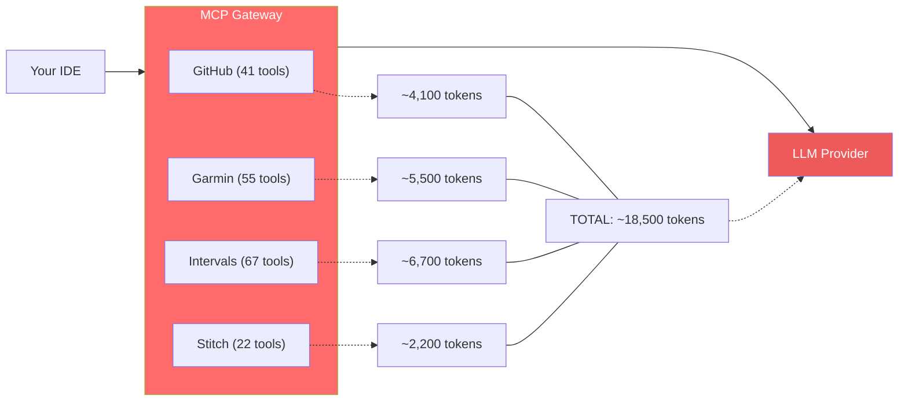
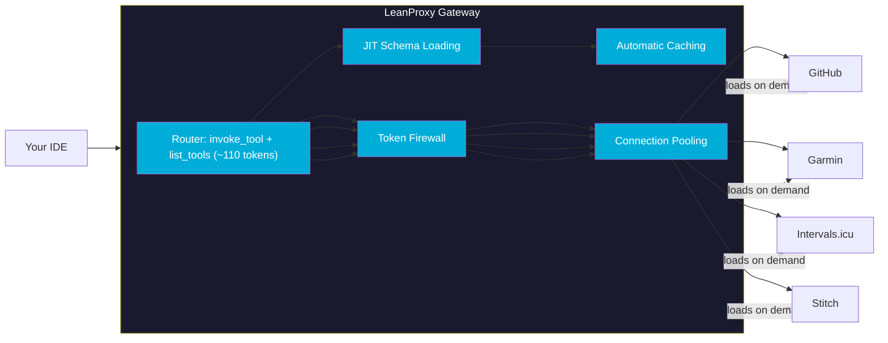
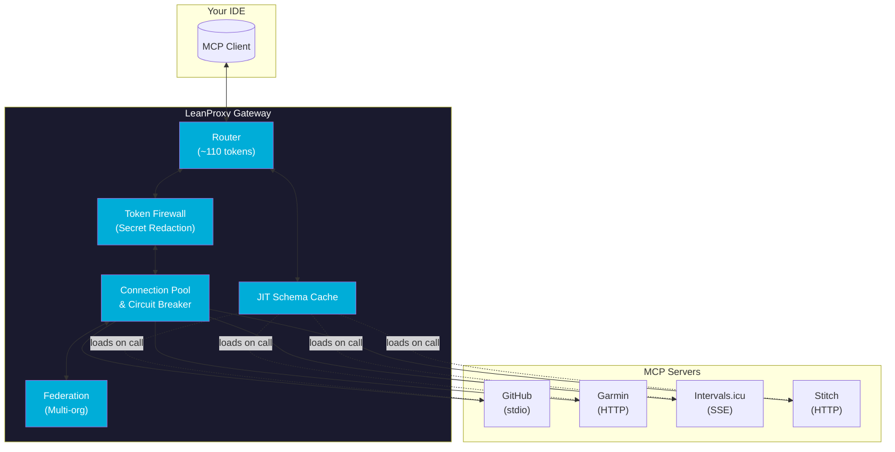

# LeanProxy-MCP

<h1 align="center">
  <picture>
    <source media="(prefers-color-scheme: dark)" srcset="https://img.shields.io/badge/LeanProxy-Token%20Firewall-1a1a2e?logo=shield">
    <source media="(prefers-color-scheme: light)" srcset="https://img.shields.io/badge/LeanProxy-Token%20Firewall-00ADD8?logo=shield">
    
  </picture>
</h1>

<p align="center">
  <strong>The Local CLI Proxy That Slashes Your AI Token Bill by 90%+</strong>
</p>

<p align="center">
  
  
  
  
  
  
</p>

---

## The MCP Schema Tax is Killing Your AI Budget

Every MCP server you connect injects **thousands of tokens** into every LLM request — even when you never use it. This is the "Schema Tax":



**The result?** You're burning tokens on tool definitions you'll never use in that session.

---

## Enter LeanProxy: Your Token Firewall

LeanProxy sits between your IDE and MCP servers as a smart gateway. It loads tool schemas **only when needed** — reducing 18,500 tokens to ~110.



---

## Real Results, Real Savings

### 90%+ Token Reduction in Production Sessions

| Session Type | Native MCP | LeanProxy | Savings |
|:-------------|:-----------|:---------|:--------|
| Morning Sport (2 servers, 4 prompts) | ~21,000 | ~2,000 | **90%** |
| Dev Workflow (2 servers, 5 prompts) | ~10,600 | ~2,400 | **77%** |
| Full Day (4 servers, 7 prompts) | ~49,600 | ~3,500 | **93%** |

### The Math Doesn't Lie

Native MCP + 100% cache hit still costs you at **0.25x** (cache read isn't free!):

| Configuration | Native MCP (cached) | LeanProxy | You Save |
|:--------------|:-------------------|:---------|:--------|
| 1 server (41 tools) | 1,025 tokens | 27 tokens | **97.3%** |
| 2 servers (53 tools) | 1,325 tokens | 27 tokens | **97.9%** |
| 4 servers (163 tools) | 4,075 tokens | 27 tokens | **99.3%** |

---

## Key Features

<div align="center">

| Feature | Benefit |
|:--------|:--------|
| 🛡️ **Token Firewall** | Redacts secrets, API keys, and PII before they reach LLM providers |
| ⚡ **JIT Schema Loading** | Tool schemas load only when actually called — not on every request |
| 🔄 **Connection Pooling** | HTTP MCP clients reuse connections with circuit breakers |
| 📦 **Multi-Transport** | Supports stdio, HTTP, and SSE transport protocols |
| 👥 **Multi-Team Namespaces** | Hierarchical organization for enterprise teams |
| 💰 **Cost Attribution** | Track token savings per server with detailed reports |
| 🧪 **Dry-Run Mode** | Simulate and preview savings without live execution |
| 🔧 **Shadow Manifesting** | Merges global and project-local MCP configurations |

</div>

---

## Quick Start

### One-Line Install

```bash
# macOS/Linux via Homebrew
brew tap mmornati/leanproxy-mcp
brew install leanproxy-mcp

# ...or download binary for your platform
curl -fsSL https://github.com/mmornati/leanproxy-mcp/releases/latest/download/leanproxy-mcp.tar.gz | tar xz
```

### Configure Your IDE

Add LeanProxy as an MCP server in your `opencode.json`:

```json
{
  "$schema": "https://opencode.ai/config.json",
  "mcp": {
    "leanproxy": {
      "type": "local",
      "command": ["leanproxy-mcp", "server", "run", "--stdio"],
      "enabled": true
    }
  }
}
```

### Run It

```bash
# Start with your MCP servers
leanproxy-mcp server run --stdio

# Preview savings without executing
leanproxy-mcp server run --dry-run --stdio

# Generate a detailed savings report
leanproxy-mcp report --output report.md
```

---

## Architecture



---

## v0.7.0: What's New

| Feature | Description |
|:--------|:------------|
| 🔐 **OAuth2 Authentication** | Built-in support for HTTP MCP servers with OAuth2 |
| 🔄 **Streamable HTTP** | Full Streamable HTTP transport implementation for MCP |
| 👥 **Hierarchical Namespaces** | Multi-team organization with namespace assignment |
| ⚡ **Connection Pooling** | HTTP clients with connection reuse and rate limiting |
| 🧠 **Lazy Schema Loading** | Schemas load only when tools are actually called |
| 🔧 **Session Re-initialization** | Fast session recovery without full restart |
| 💰 **Cost Attribution** | Per-server cost tracking and reporting |

---

## Join the Community

<p align="center">
  <a href="https://github.com/mmornati/leanproxy-mcp">GitHub</a> •
  <a href="https://mmornati.github.io/leanproxy-mcp/">Documentation</a> •
  <a href="https://github.com/mmornati/leanproxy-mcp/issues">Issues</a>
</p>

---

## License

MIT © [Matteo Mornati](https://github.com/mmornati)
