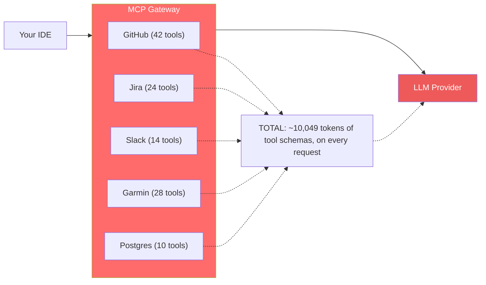
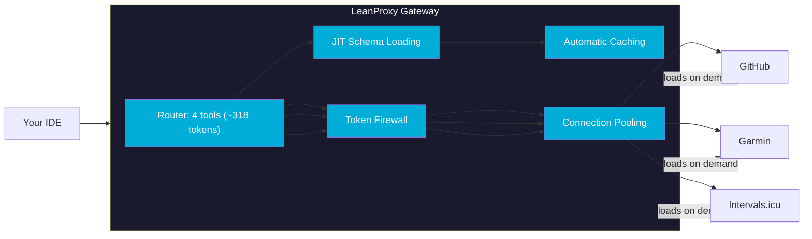
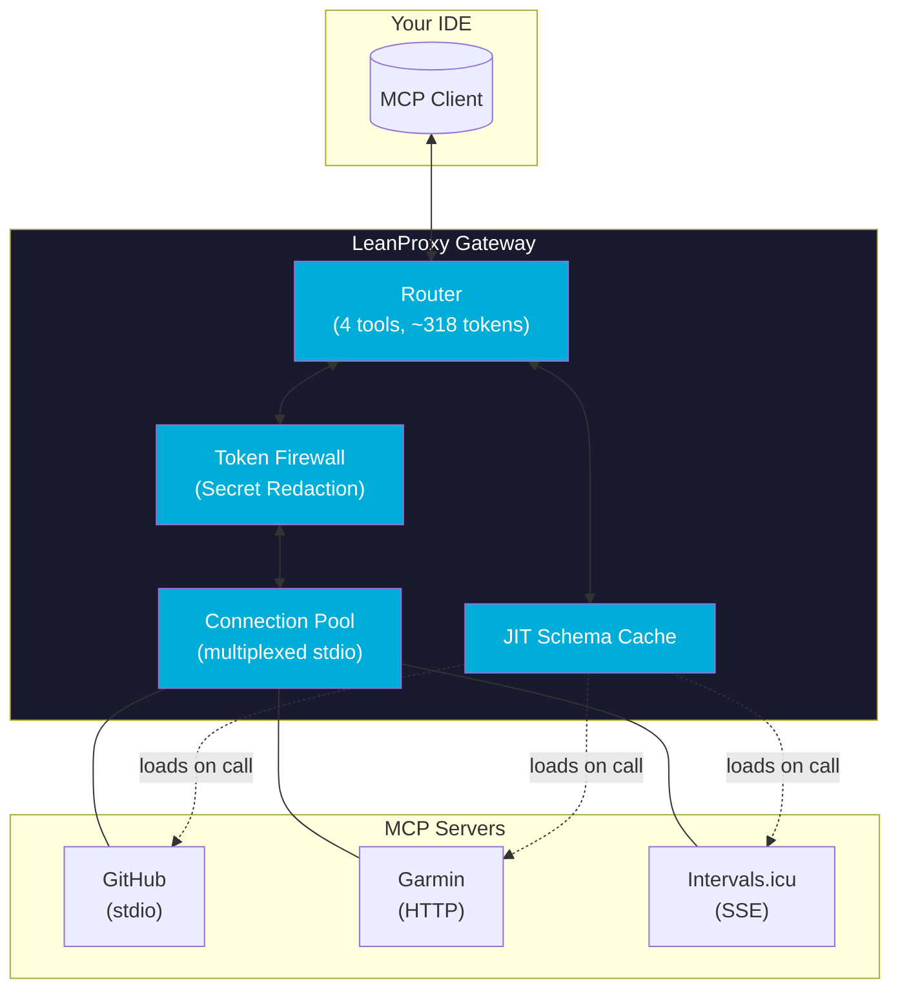

# LeanProxy-MCP

<h1 align="center">
  <picture>
    <source media="(prefers-color-scheme: dark)" srcset="https://img.shields.io/badge/LeanProxy-Token%20Firewall-1a1a2e?logo=shield">
    <source media="(prefers-color-scheme: light)" srcset="https://img.shields.io/badge/LeanProxy-Token%20Firewall-00ADD8?logo=shield">
    
  </picture>
</h1>

<p align="center">
  <strong>Your local-first MCP security layer — and the proxy that slashes your AI token bill</strong>
</p>

<p align="center">
  
  
  
  
  
  
</p>

<p align="center">
  <strong>📖 Documentation: <a href="https://mmornati.github.io/leanproxy-mcp/">mmornati.github.io/leanproxy-mcp</a></strong>
  · <a href="https://mmornati.github.io/leanproxy-mcp/installation/">Installation</a>
  · <a href="https://mmornati.github.io/leanproxy-mcp/quickstart/">Quick Start</a>
  · <a href="https://mmornati.github.io/leanproxy-mcp/configuration/">Configuration</a>
</p>

---

## Latest Benchmark

Measured by `make harness`: the real `leanproxy-mcp server run --stdio` binary, driven over pipes, in front of 5 mock MCP servers that serve a realistic 118-tool catalog (GitHub, Jira/Confluence, Slack, Garmin, Postgres). Run on linux/amd64 (4 CPUs) at commit `430f9a8`. Tokens use `pkg/reporter.Estimator` (1 token ≈ 4 chars). Every row below is a line of `bench-results/harness.md`.

| Metric | Measured | Threshold | Status |
|---|---|---|---|
| Session savings, Morning Sport (4 prompts, 2 servers): `list_tools` / `search_tools` discovery | **−86.0%** (+3 turns) / **−93.5%** (+4 turns) | – | measured |
| Session savings, Dev Workflow (5 prompts, 2 servers): `list_tools` / `search_tools` | **−74.0%** (+3 turns) / **−84.4%** (+6 turns) | – | measured |
| Session savings, Full Day (7 prompts, 3 servers): `list_tools` / `search_tools` | **−70.9%** (+4 turns) / **−65.0%** (+10 turns, 3 search misses) | – | measured |
| `search_tools` lookup (k=5), 83 labeled intents | **152 tokens** avg (vs 907 for `list_tools(server)`), right tool in top 5 for **85.5%** | – | measured |
| Proxy overhead, p50 / p95 (proxied − direct) | **0.56 / 0.74 ms** | p95 < 5 ms | ✅ |
| 500-call pipelined burst over 5 servers | **0 errors**, 9,723 req/s | 0 errors | ✅ |
| 50 parallel calls to a 100 ms tool | **205 ms** wall | < 1 s | ✅ |
| 5 MB tool response relayed | **581 ms** (direct: 51 ms) | relayed intact | ✅ |
| Large tool results (a 200 KB file + 4 list/search endpoints) with the opt-in response governor, `max_tokens: 4000` | **234,700 → 18,515 tokens (−92.1%)**, pages back byte-identical via `read_result` | ≥ 50% | ✅ |
| Repeated reads in one session (opt-in `response.dedup: on`), same file re-read 3× | **13,780 → 3,640 tokens (−73.6%)**, a repeat read is 98.1% smaller | ≥ 30% | ✅ |
| Secret redaction, both directions (incl. `search_tools` output) | **0 of 3** fake secrets leaked | active | ✅ |
| Proxy RSS, idle / after burst | **20.4 / 22.5 MiB** | – | measured |
| Binary size (linux/amd64, stripped) | **16.4 MiB** | < 20 MB | ✅ |

> The savings include LeanProxy's own discovery outputs (`list_servers`, `list_tools`, `search_tools`), and the table reports the extra turns they cost. Earlier versions of this table left both out and reported 81.5–93.7% session savings. **Methodology, assumptions and full results: [docs/benchmark-results.md](docs/benchmark-results.md).**

---

## Your Local-First MCP Security Layer

MCP servers run arbitrary, third-party code with your credentials and your filesystem access, and their tool descriptions and results are untrusted input the model reads. LeanProxy sits in front of every one of them, locally, and adds the layer most setups are missing:

- **Redacts secrets** in tool arguments and responses, both directions, before they reach an LLM provider. On by default: 29 built-in patterns, plus your own; an optional high-entropy detector.
- **Screens for prompt injection** (opt-in, `injection.enabled: true`) in requests and tool output, with configurable risk-band actions (block / quarantine / redact / log) and a local classifier.
- **Pins every upstream tool definition** and flags drift ("rug pulls"), scans descriptions for hidden instructions and invisible unicode.
- **Per-tool policy**: allow / deny / confirm rules by tool and by annotation (e.g. require confirmation on anything `destructiveHint`), refuses calls to tools a server never advertised.
- **Sandboxes** third-party stdio servers in a container with no network and no filesystem access by default, and gives each server a minimal environment instead of your full one.
- **One command tells you where you stand:** `leanproxy-mcp doctor security` — a local-only, read-only report mapped to the [OWASP MCP Top 10](docs/security.md#owasp-mcp-top-10-security-report-doctor-security-323), with a `--json` form for CI. See [docs/security.md](docs/security.md) for the full threat model — what this protects against and what it does not.

None of this calls out to a third-party service: the proxy, the classifier, the redaction patterns and the report all run on your machine, against your own config. LeanProxy only contacts other services for features you turn on: OpenAI embeddings for hybrid tool search, OpenTelemetry export, and `marketplace sync` (see the [FAQ](https://mmornati.github.io/leanproxy-mcp/faq/#is-my-data-sent-anywhere)).

---

## The MCP Schema Tax is Killing Your AI Budget

Every MCP server you connect injects **thousands of tokens** into every LLM request — even when you never use it. This is the "Schema Tax":


```mermaid
flowchart LR
    IDE["Your IDE"] --> MCP["MCP Gateway"]

    subgraph MCP["MCP Gateway"]
        S1["GitHub (42 tools)"]
        S2["Jira (24 tools)"]
        S3["Slack (14 tools)"]
        S4["Garmin (28 tools)"]
        S5["Postgres (10 tools)"]
    end

    MCP --> LLM["LLM Provider"]

    total["TOTAL: ~10,049 tokens of tool schemas, on every request"]

    S1 -.-> total
    S2 -.-> total
    S3 -.-> total
    S4 -.-> total
    S5 -.-> total
    total -.-> LLM

    style MCP fill:#ff6b6b,color:#fff
    style LLM fill:#ee5a5a,color:#fff
```

**The result?** You're burning tokens on tool definitions you'll never use in that session. The numbers above are the harness catalog's native `tools/list` payloads; see [Latest Benchmark](#latest-benchmark).

> **Honest caveat:** some clients now do their own tool search or deferred loading (Claude Code, Claude Desktop, Cursor, VS Code). For those, LeanProxy lists every upstream tool directly (passthrough, [#322](https://github.com/mmornati/leanproxy-mcp/issues/322)) instead of hiding them behind a router — the schema tax above is *their* problem to solve, not one LeanProxy still needs to. The security layers (redaction, injection guard, policy, pinning) still apply to every listed tool and every call either way. See [Real Results, Real Savings](#real-results-real-savings) for what LeanProxy actually saves on the response side, which does not depend on which mode a client uses.

---

## Enter LeanProxy: Your Token Firewall

LeanProxy sits between your IDE and MCP servers as a smart gateway. It loads tool schemas **only when needed** — reducing the schema tax to a single 318-token router payload (4 tools: `search_tools`, `list_servers`, `list_tools`, `invoke_tool`). The model finds a tool across every server with one `search_tools` call, then runs it with `invoke_tool`.

**Clients with native tool search get the tools directly.** Claude Code, Claude Desktop, Cursor and VS Code already defer and search large tool lists themselves, so LeanProxy lists every upstream tool for them as `<server>__<tool>` (passthrough mode) and stays the aggregation and security layer: pinning, per-tool policy, redaction, the injection guard and the response governor still apply to every listed tool and every call. Any other client gets the router. Which IDE gets which mode, and why: [Quick Start](docs/quickstart.md#which-exposure-mode-each-ide-gets); the measured trade-off: [benchmark §10](docs/benchmark-results.md#10-exposure-modes-322).


```mermaid
flowchart LR
    IDE["Your IDE"] --> Gateway["LeanProxy Gateway"]

    subgraph Gateway["LeanProxy Gateway"]
        Router["Router: 4 tools (~318 tokens)"]
        JIT["JIT Schema Loading"]
        Cache["Automatic Caching"]
        Firewall["Token Firewall"]
        Pool["Connection Pooling"]
    end

    Gateway -.->|"loads on demand"| GH["GitHub"]
    Gateway -.->|"loads on demand"| Garmin["Garmin"]
    Gateway -.->|"loads on demand"| Intervals["Intervals.icu"]

    Router --> Firewall --> Pool --> GH
    Router --> Firewall --> Pool --> Garmin
    Router --> Firewall --> Pool --> Intervals

    Router --> JIT
    JIT --> Cache

    style Gateway fill:#1a1a2e,color:#fff
    style Router fill:#00ADD8,color:#fff
    style JIT fill:#00ADD8,color:#fff
    style Cache fill:#00ADD8,color:#fff
    style Firewall fill:#00ADD8,color:#fff
    style Pool fill:#00ADD8,color:#fff
```

---

## Real Results, Real Savings

### 65–94% Fewer Tokens per Session (measured by `make harness`)

| Session | Native MCP (0.25× cache read) | LeanProxy, `list_tools` discovery | Savings | Extra LLM turns | LeanProxy, `search_tools` discovery | Savings | Extra LLM turns |
|:--------|:------------------------------|:----------|:--------|:----------------|:----------|:--------|:----------------|
| Morning Sport (4 prompts, 2 of 5 servers) | 17,586 | 2,470 | **−86.0%** | +3 | 1,148 | **−93.5%** | +4 |
| Dev Workflow (5 prompts, 2 of 5 servers) | 20,098 | 5,234 | **−74.0%** | +3 | 3,143 | **−84.4%** | +6 |
| Full Day (7 prompts, 3 of 5 servers) | 25,123 | 7,302 | **−70.9%** | +4 | 8,793 | **−65.0%** | +10 |

**How these are counted.**

- **Native MCP.** All 5 configured servers' `tools/list` payloads are in context on every turn: the first turn at full price, later turns at the 0.25× cache-read rate.
- **LeanProxy.**
  - The 318-token router is in context from the start.
  - Discovery outputs join the context the turn they are fetched, at full price. With `list_tools`: `list_servers` on the first turn, and `list_tools(server)` the first time a server is used. With `search_tools`: one search the first time a tool is needed; when the tool is not in the top 5 (3 of Full Day's 7 queries), the model falls back to `list_tools(server)` and pays both.
  - Later turns re-read everything already in context at 0.25×.
- **Extra LLM turns.** Each discovery call is one extra round-trip. The table counts them, but their token cost is not included, so the savings are an upper bound.
- **Tool results.** They are the same on both paths and left out of both.

### What Sits in Context Before the First Tool Call

| Configuration | Native `tools/list` | LeanProxy router | Savings |
|:--------------|:--------------------|:-----------------|:--------|
| 1 server (GitHub, 42 tools) | 4,443 tokens | 318 tokens | **−92.8%** |
| 1 server (Jira/Confluence, 24 tools) | 2,043 tokens | 318 tokens | **−84.4%** |
| 1 server (Garmin, 28 tools) | 1,795 tokens | 318 tokens | **−82.3%** |
| 1 server (Slack, 14 tools) | 1,128 tokens | 318 tokens | **−71.8%** |
| 1 server (Postgres, 10 tools) | 640 tokens | 318 tokens | **−50.3%** |
| 5 servers (118 tools) | 10,049 tokens | 318 tokens | **−96.8%** |

This table counts only the static schema load. LeanProxy fetches tools on demand, with `search_tools` (152 tokens per lookup on average) or `list_tools` (GitHub: 1,638 tokens), and the session table above includes that cost. See [docs/benchmark-results.md](docs/benchmark-results.md) for the per-server `list_tools` sizes and the full methodology.

---

## How LeanProxy Compares

A non-exhaustive comparison against other self-hostable MCP gateways/proxies, based on each project's own public documentation at the time of writing (2026-09); verify against the linked source before relying on any row, since these projects move fast.

| | LeanProxy | [MCPProxy](https://mcpproxy.app/) | [ToolHive](https://github.com/stacklok/toolhive) | [Docker MCP Gateway](https://github.com/docker/mcp-gateway) | [LiteLLM MCP Gateway](https://docs.litellm.ai/docs/mcp) |
|---|---|---|---|---|---|
| Local, self-hosted binary | ✅ | ✅ | ✅ | ✅ | ✅ |
| Response-side token governor (per-tool budgets, projection, dedup, spill-store paging) | ✅ | not documented | not documented | not documented | not documented |
| Prompt-injection classifier (request + response) | ✅ (local, no network call) | not documented | not documented | not documented | not documented |
| Tool pinning / rug-pull drift detection | ✅ | ✅ (schema quarantine) | not documented as such | not documented | not documented |
| Per-tool allow/deny/confirm policy | ✅ | not documented | ✅ (access policies) | not documented | ✅ (per key/team/org) |
| Sandboxes stdio servers (container isolation) | ✅ (opt-in, docker/podman) | not documented | ✅ (runs servers via Docker/Podman) | ✅ (host-local) | not applicable (model-call gateway) |
| Native tool search / BM25 discovery | ✅ (`search_tools`) | ✅ (BM25) | not documented | not documented | not documented |
| Primary focus | MCP proxy: token cost + local security | MCP proxy: tool discovery + quarantine | MCP runtime: deployment, OAuth/OIDC, policy, audit | MCP proxy: container-based server aggregation | LLM gateway: 100+ model providers, MCP as one feature |

LeanProxy's niche is the combination: token-cost reduction (response governor, schema loading) *and* a local, no-network-call security layer (redaction, injection guard, policy, pinning) in one small Go binary. ToolHive and Docker MCP Gateway focus more on deployment/runtime concerns (OAuth, Kubernetes, container orchestration); LiteLLM's MCP support is one feature of a much broader LLM-gateway product; MCPProxy is the closest in spirit (tool discovery + a quarantine concept) but does not document a response-side token governor or a request/response injection classifier.

---

## Key Features

<div align="center">

| Feature | Benefit |
|:--------|:--------|
| 🛡️ **Token Firewall** | Redacts secrets in tool arguments and responses (on by default) and, when enabled, screens calls for prompt injection — in `server run --stdio`, `server run --http` and `serve` |
| ⚡ **JIT Schema Loading** | Tool schemas load only when actually called — not on every request |
| 🔎 **Works With Native Tool Search** | Passthrough mode for clients that defer tools themselves (Claude Code, Cursor, VS Code, Claude Desktop): every tool listed as `<server>__<tool>` with full metadata and `tools/list_changed`, every security layer still applied; `--exposure` or `exposure:` to choose per client ([docs](docs/configuration.md#exposure-modes-exposure)) |
| ✂️ **Response Token Governor** | Opt-in: drops unneeded JSON fields per tool (`keep`/`drop` projection rules, a default noise pack, or the model's `fields` argument), caps large tool results (smart head/tail truncation, structural JSON truncation), dedups a result byte-identical to one already seen this session (never across sessions), and can hand a still-oversized result to a local Ollama model for summarization (falls back to truncation on any failure) — keeps the full result per session for paged `read_result` / `grep` / `jsonpath` retrieval — −92% on a large-results session, −72% from projection alone on a GitHub issue listing, −74% on a repeated-reads session ([docs](docs/configuration.md#response-token-governor-response)) |
| 🔄 **Connection Pooling** | HTTP MCP clients reuse connections; concurrent calls to a stdio server are multiplexed over its single pipe |
| 📦 **Multi-Transport** | Upstream servers over stdio, Streamable HTTP or SSE; clients over stdio or one shared Streamable HTTP gateway (`server run --http`) |
| 📊 **Auditable Savings Report** | `leanproxy-mcp report` built from counters the proxy actually recorded, by tool, server or session; export to CSV, JSON or Markdown |
| 🩺 **Security Report** | `leanproxy-mcp doctor security`: local, read-only checks mapped to the OWASP MCP Top 10, with `--json` for CI |

</div>

---

## Quick Start

Releases are published for macOS and Linux (amd64 and arm64). There is no Windows release. Full guide: [Installation](https://mmornati.github.io/leanproxy-mcp/installation/).

### Install

```bash
# macOS/Linux via Homebrew
brew tap mmornati/leanproxy-mcp https://github.com/mmornati/leanproxy-mcp
brew install leanproxy-mcp
```

Or download the latest release for your platform:

```bash
VERSION=$(curl -fsSL https://api.github.com/repos/mmornati/leanproxy-mcp/releases/latest | sed -n 's/.*"tag_name": *"\([^"]*\)".*/\1/p')
OS=$(uname -s | tr '[:upper:]' '[:lower:]'); ARCH=$(uname -m)
case "$ARCH" in x86_64) ARCH=amd64 ;; aarch64) ARCH=arm64 ;; esac
curl -fsSL "https://github.com/mmornati/leanproxy-mcp/releases/download/${VERSION}/leanproxy-mcp_${VERSION#v}_${OS}_${ARCH}.tar.gz" | tar xz leanproxy-mcp
sudo mv leanproxy-mcp /usr/local/bin/
```

### Add Your MCP Servers

```bash
# Import the servers your IDE already has (preview first)
leanproxy-mcp migrate --dry-run
leanproxy-mcp migrate

# ...or add one by hand: note the "--" before the server's command
leanproxy-mcp server add filesystem -- npx -y @modelcontextprotocol/server-filesystem "$HOME/projects"
```

Servers live in `~/.config/leanproxy_servers.yaml`.

### Connect Your IDE

Every client starts the same command, `leanproxy-mcp server run --stdio`. For Claude Code:

```bash
claude mcp add leanproxy -- leanproxy-mcp server run --stdio
```

For OpenCode (`~/.config/opencode/opencode.json`):

```json
{
  "$schema": "https://opencode.ai/config.json",
  "mcp": {
    "leanproxy": {
      "type": "local",
      "command": ["leanproxy-mcp", "server", "run", "--stdio"],
      "enabled": true
    }
  }
}
```

Claude Desktop, Cursor, VS Code, and one shared HTTP gateway for several clients (`server run --http`): see [Connect your client](https://mmornati.github.io/leanproxy-mcp/quickstart/#connect-your-client).

### Check It

```bash
# See which security layers your config turns on
leanproxy-mcp doctor security

# Auditable savings report, built from real counters (docs/savings-report.md)
leanproxy-mcp report
leanproxy-mcp report --export md --output report.md
```

---

## Architecture


```mermaid
flowchart TB
    subgraph IDE["Your IDE"]
        Client[(MCP Client)]
    end

    subgraph Gateway["LeanProxy Gateway"]
        Router["Router<br/>(4 tools, ~318 tokens)"]
        JIT["JIT Schema Cache"]
        Firewall["Token Firewall<br/>(Secret Redaction)"]
        Pool["Connection Pool<br/>(multiplexed stdio)"]
    end

    subgraph Servers["MCP Servers"]
        GH["GitHub<br/>(stdio)"]
        Garmin["Garmin<br/>(HTTP)"]
        Intervals["Intervals.icu<br/>(SSE)"]
    end

    Client <--> Router
    Router <--> JIT
    Router <--> Firewall
    Firewall <--> Pool

    Pool --- GH
    Pool --- Garmin
    Pool --- Intervals

    JIT -.->|"loads on call"| GH
    JIT -.->|"loads on call"| Garmin
    JIT -.->|"loads on call"| Intervals

    style Gateway fill:#1a1a2e,color:#fff
    style Router fill:#00ADD8,color:#fff
    style JIT fill:#00ADD8,color:#fff
    style Firewall fill:#00ADD8,color:#fff
    style Pool fill:#00ADD8,color:#fff
```

---

## v0.11: What's New

| Feature | Description |
|:--------|:------------|
| 🔎 **`search_tools`** | Ranked (BM25, optional hybrid embeddings) tool search across every server in one call |
| 🔀 **Exposure Modes** | Passthrough for clients with their own tool search (Claude Code, Claude Desktop, Cursor, VS Code), router for the rest; `--exposure` / `exposure:` to choose |
| 🌐 **Streamable HTTP Front End** | `server run --http`: one local, token-protected gateway shared by several MCP clients; replaces the deprecated `serve` |
| ✂️ **Response Token Governor** | Opt-in truncation with paged `read_result`, per-tool field projection, in-session dedup and optional local-LLM summarization |
| 📌 **Tool Pinning** | Hashes every upstream tool definition, warns about or blocks rug pulls and poisoned descriptions (`leanproxy-mcp tools pins`) |
| 🚦 **Per-Tool Policy** | Allow / deny / confirm rules per `server.tool` glob and annotation; no calls to tools a server does not advertise (`leanproxy-mcp policy check`) |
| 🛡️ **Prompt-Injection Guard v2** | Scans decoded text and tool outputs, per-direction risk-band actions, optional local judge model |
| 📦 **Sandbox** | Optional Docker/Podman isolation for stdio servers, with no network and no host filesystem by default |
| 🔐 **Least-Privilege Environment** | Stdio servers get a minimal environment instead of the proxy's full one (`doctor env`) |
| 🛒 **Marketplace Integrity** | Official MCP Registry by default, version-pinned installs, a trust score from verifiable signals only, confirm before enable |
| 🩺 **`doctor security`** | Local security report mapped to the OWASP MCP Top 10 |
| 📊 **Auditable `report`** | Savings report from real counters, exportable to CSV, JSON or Markdown |
| 📈 **OpenTelemetry** | Opt-in OTLP traces and metrics for the MCP pipeline |
| 🔄 **MCP Protocol Upgrade** | Version negotiation, resources and prompts aggregation, sampling/roots/elicitation relay, progress and cancellation |

See [CHANGELOG.md](CHANGELOG.md) for the full list and the breaking changes.

See [CHANGELOG.md](CHANGELOG.md#removed-in-v010) for the features removed in v0.10 (budget management,
federation, model routing, lazy tool-schema loading, and the MLX sidecar placeholder) because they were
never wired into any command.

---

## Join the Community

<p align="center">
  <a href="https://github.com/mmornati/leanproxy-mcp">GitHub</a> •
  <a href="https://mmornati.github.io/leanproxy-mcp/">Documentation</a> •
  <a href="https://github.com/mmornati/leanproxy-mcp/issues">Issues</a>
</p>

---

## License

MIT © [Marco Mornati](https://github.com/mmornati)
