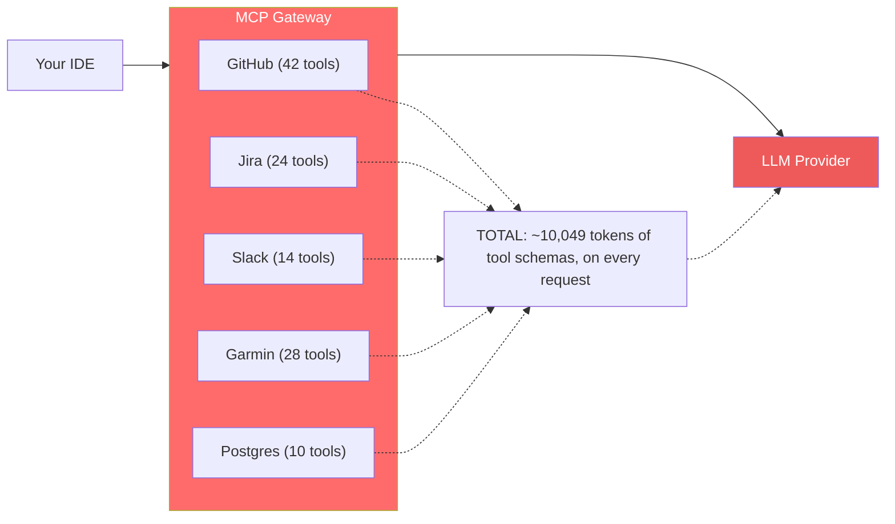
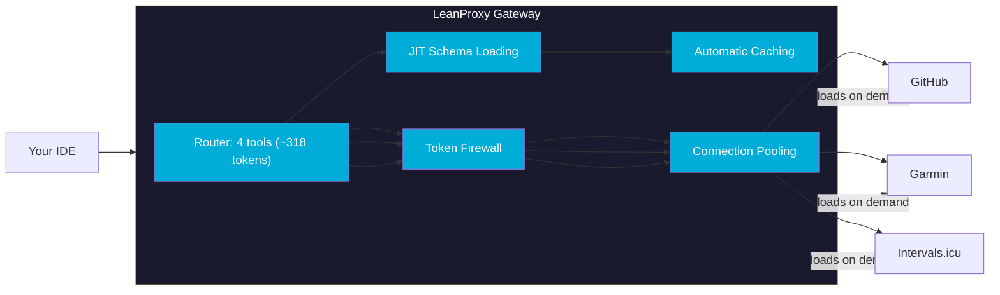
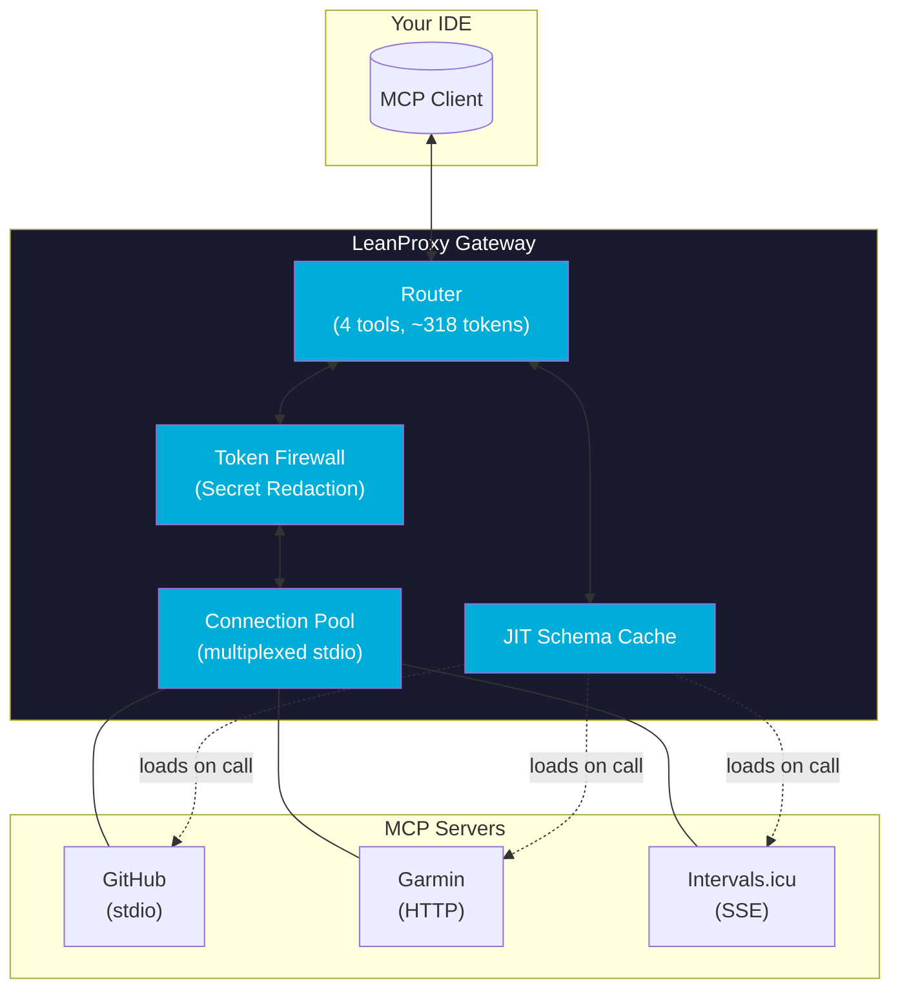

# LeanProxy-MCP

<h1 align="center">
  <picture>
    <source media="(prefers-color-scheme: dark)" srcset="https://img.shields.io/badge/LeanProxy-Token%20Firewall-1a1a2e?logo=shield">
    <source media="(prefers-color-scheme: light)" srcset="https://img.shields.io/badge/LeanProxy-Token%20Firewall-00ADD8?logo=shield">
    
  </picture>
</h1>

<p align="center">
  <strong>The Local CLI Proxy That Slashes Your AI Token Bill</strong>
</p>

<p align="center">
  
  
  
  
  
  
</p>

---

## Latest Benchmark

Measured by `make harness`: the real `leanproxy-mcp server run --stdio` binary, driven over pipes, in front of 5 mock MCP servers that serve a realistic 118-tool catalog (GitHub, Jira/Confluence, Slack, Garmin, Postgres). Run on linux/amd64 (4 CPUs) at commit `430f9a8`. Tokens use `pkg/reporter.Estimator` (1 token ≈ 4 chars). Every row below is a line of `bench-results/harness.md`.

| Metric | Measured | Threshold | Status |
|---|---|---|---|
| Session savings, Morning Sport (4 prompts, 2 servers): `list_tools` / `search_tools` discovery | **−86.0%** (+3 turns) / **−93.5%** (+4 turns) | – | measured |
| Session savings, Dev Workflow (5 prompts, 2 servers): `list_tools` / `search_tools` | **−74.0%** (+3 turns) / **−84.4%** (+6 turns) | – | measured |
| Session savings, Full Day (7 prompts, 3 servers): `list_tools` / `search_tools` | **−70.9%** (+4 turns) / **−65.0%** (+10 turns, 3 search misses) | – | measured |
| `search_tools` lookup (k=5), 83 labeled intents | **152 tokens** avg (vs 907 for `list_tools(server)`), right tool in top 5 for **85.5%** | – | measured |
| Proxy overhead, p50 / p95 (proxied − direct) | **0.56 / 0.74 ms** | p95 < 5 ms | ✅ |
| 500-call pipelined burst over 5 servers | **0 errors**, 9,723 req/s | 0 errors | ✅ |
| 50 parallel calls to a 100 ms tool | **205 ms** wall | < 1 s | ✅ |
| 5 MB tool response relayed | **581 ms** (direct: 51 ms) | relayed intact | ✅ |
| Large tool results (a 200 KB file + 4 list/search endpoints) with the opt-in response governor, `max_tokens: 4000` | **234,700 → 18,515 tokens (−92.1%)**, pages back byte-identical via `read_result` | ≥ 50% | ✅ |
| Secret redaction, both directions (incl. `search_tools` output) | **0 of 3** fake secrets leaked | active | ✅ |
| Proxy RSS, idle / after burst | **20.4 / 22.5 MiB** | – | measured |
| Binary size (linux/amd64, stripped) | **16.4 MiB** | < 20 MB | ✅ |

> The savings include LeanProxy's own discovery outputs (`list_servers`, `list_tools`, `search_tools`), and the table reports the extra turns they cost. Earlier versions of this table left both out and reported 81.5–93.7% session savings. **Methodology, assumptions and full results: [docs/benchmark-results.md](docs/benchmark-results.md).**

---

## The MCP Schema Tax is Killing Your AI Budget

Every MCP server you connect injects **thousands of tokens** into every LLM request — even when you never use it. This is the "Schema Tax":


```mermaid
flowchart LR
    IDE["Your IDE"] --> MCP["MCP Gateway"]

    subgraph MCP["MCP Gateway"]
        S1["GitHub (42 tools)"]
        S2["Jira (24 tools)"]
        S3["Slack (14 tools)"]
        S4["Garmin (28 tools)"]
        S5["Postgres (10 tools)"]
    end

    MCP --> LLM["LLM Provider"]

    total["TOTAL: ~10,049 tokens of tool schemas, on every request"]

    S1 -.-> total
    S2 -.-> total
    S3 -.-> total
    S4 -.-> total
    S5 -.-> total
    total -.-> LLM

    style MCP fill:#ff6b6b,color:#fff
    style LLM fill:#ee5a5a,color:#fff
```

**The result?** You're burning tokens on tool definitions you'll never use in that session. The numbers above are the harness catalog's native `tools/list` payloads; see [Latest Benchmark](#latest-benchmark).

---

## Enter LeanProxy: Your Token Firewall

LeanProxy sits between your IDE and MCP servers as a smart gateway. It loads tool schemas **only when needed** — reducing the schema tax to a single 318-token router payload (4 tools: `search_tools`, `list_servers`, `list_tools`, `invoke_tool`). The model finds a tool across every server with one `search_tools` call, then runs it with `invoke_tool`.


```mermaid
flowchart LR
    IDE["Your IDE"] --> Gateway["LeanProxy Gateway"]

    subgraph Gateway["LeanProxy Gateway"]
        Router["Router: 4 tools (~318 tokens)"]
        JIT["JIT Schema Loading"]
        Cache["Automatic Caching"]
        Firewall["Token Firewall"]
        Pool["Connection Pooling"]
    end

    Gateway -.->|"loads on demand"| GH["GitHub"]
    Gateway -.->|"loads on demand"| Garmin["Garmin"]
    Gateway -.->|"loads on demand"| Intervals["Intervals.icu"]

    Router --> Firewall --> Pool --> GH
    Router --> Firewall --> Pool --> Garmin
    Router --> Firewall --> Pool --> Intervals

    Router --> JIT
    JIT --> Cache

    style Gateway fill:#1a1a2e,color:#fff
    style Router fill:#00ADD8,color:#fff
    style JIT fill:#00ADD8,color:#fff
    style Cache fill:#00ADD8,color:#fff
    style Firewall fill:#00ADD8,color:#fff
    style Pool fill:#00ADD8,color:#fff
```

---

## Real Results, Real Savings

### 65–94% Fewer Tokens per Session (measured by `make harness`)

| Session | Native MCP (0.25× cache read) | LeanProxy, `list_tools` discovery | Savings | Extra LLM turns | LeanProxy, `search_tools` discovery | Savings | Extra LLM turns |
|:--------|:------------------------------|:----------|:--------|:----------------|:----------|:--------|:----------------|
| Morning Sport (4 prompts, 2 of 5 servers) | 17,586 | 2,470 | **−86.0%** | +3 | 1,148 | **−93.5%** | +4 |
| Dev Workflow (5 prompts, 2 of 5 servers) | 20,098 | 5,234 | **−74.0%** | +3 | 3,143 | **−84.4%** | +6 |
| Full Day (7 prompts, 3 of 5 servers) | 25,123 | 7,302 | **−70.9%** | +4 | 8,793 | **−65.0%** | +10 |

**How these are counted.**

- **Native MCP.** All 5 configured servers' `tools/list` payloads are in context on every turn: the first turn at full price, later turns at the 0.25× cache-read rate.
- **LeanProxy.**
  - The 318-token router is in context from the start.
  - Discovery outputs join the context the turn they are fetched, at full price. With `list_tools`: `list_servers` on the first turn, and `list_tools(server)` the first time a server is used. With `search_tools`: one search the first time a tool is needed; when the tool is not in the top 5 (3 of Full Day's 7 queries), the model falls back to `list_tools(server)` and pays both.
  - Later turns re-read everything already in context at 0.25×.
- **Extra LLM turns.** Each discovery call is one extra round-trip. The table counts them, but their token cost is not included, so the savings are an upper bound.
- **Tool results.** They are the same on both paths and left out of both.

### What Sits in Context Before the First Tool Call

| Configuration | Native `tools/list` | LeanProxy router | Savings |
|:--------------|:--------------------|:-----------------|:--------|
| 1 server (GitHub, 42 tools) | 4,443 tokens | 318 tokens | **−92.8%** |
| 1 server (Jira/Confluence, 24 tools) | 2,043 tokens | 318 tokens | **−84.4%** |
| 1 server (Garmin, 28 tools) | 1,795 tokens | 318 tokens | **−82.3%** |
| 1 server (Slack, 14 tools) | 1,128 tokens | 318 tokens | **−71.8%** |
| 1 server (Postgres, 10 tools) | 640 tokens | 318 tokens | **−50.3%** |
| 5 servers (118 tools) | 10,049 tokens | 318 tokens | **−96.8%** |

This table counts only the static schema load. LeanProxy fetches tools on demand, with `search_tools` (152 tokens per lookup on average) or `list_tools` (GitHub: 1,638 tokens), and the session table above includes that cost. See [docs/benchmark-results.md](docs/benchmark-results.md) for the per-server `list_tools` sizes and the full methodology.

---

## Key Features

<div align="center">

| Feature | Benefit |
|:--------|:--------|
| 🛡️ **Token Firewall** | Redacts secrets in tool arguments and responses (on by default) and screens calls for prompt injection — in both `server run --stdio` and `serve` |
| ⚡ **JIT Schema Loading** | Tool schemas load only when actually called — not on every request |
| ✂️ **Response Token Governor** | Opt-in: drops unneeded JSON fields per tool (`keep`/`drop` projection rules, a default noise pack, or the model's `fields` argument), caps large tool results (smart head/tail truncation, structural JSON truncation) and keeps the full result per session for paged `read_result` / `grep` / `jsonpath` retrieval — −92% on a large-results session, −72% from projection alone on a GitHub issue listing ([docs](docs/configuration.md#response-token-governor-response)) |
| 🔄 **Connection Pooling** | HTTP MCP clients reuse connections; concurrent calls to a stdio server are multiplexed over its single pipe |
| 📦 **Multi-Transport** | Supports stdio, HTTP, and SSE transport protocols |
| 👥 **Multi-Team Namespaces** | Hierarchical organization for enterprise teams |
| 💰 **Cost Attribution** | Track token savings per server with detailed reports |
| 🧪 **Dry-Run Mode** | Simulate and preview savings without live execution |

</div>

---

## Quick Start

### One-Line Install

```bash
# macOS/Linux via Homebrew
brew tap mmornati/leanproxy-mcp https://github.com/mmornati/leanproxy-mcp
brew install leanproxy-mcp

# ...or download binary for your platform
curl -fsSL https://github.com/mmornati/leanproxy-mcp/releases/latest/download/leanproxy-mcp.tar.gz | tar xz
```

### Configure Your IDE

Add LeanProxy as an MCP server in your `opencode.json`:

```json
{
  "$schema": "https://opencode.ai/config.json",
  "mcp": {
    "leanproxy": {
      "type": "local",
      "command": ["leanproxy-mcp", "server", "run", "--stdio"],
      "enabled": true
    }
  }
}
```

### Run It

```bash
# Start with your MCP servers
leanproxy-mcp server run --stdio

# Preview savings without executing
leanproxy-mcp server run --dry-run --stdio

# Generate a detailed savings report
leanproxy-mcp report --output report.md
```

---

## Architecture


```mermaid
flowchart TB
    subgraph IDE["Your IDE"]
        Client[(MCP Client)]
    end

    subgraph Gateway["LeanProxy Gateway"]
        Router["Router<br/>(4 tools, ~318 tokens)"]
        JIT["JIT Schema Cache"]
        Firewall["Token Firewall<br/>(Secret Redaction)"]
        Pool["Connection Pool<br/>(multiplexed stdio)"]
    end

    subgraph Servers["MCP Servers"]
        GH["GitHub<br/>(stdio)"]
        Garmin["Garmin<br/>(HTTP)"]
        Intervals["Intervals.icu<br/>(SSE)"]
    end

    Client <--> Router
    Router <--> JIT
    Router <--> Firewall
    Firewall <--> Pool

    Pool --- GH
    Pool --- Garmin
    Pool --- Intervals

    JIT -.->|"loads on call"| GH
    JIT -.->|"loads on call"| Garmin
    JIT -.->|"loads on call"| Intervals

    style Gateway fill:#1a1a2e,color:#fff
    style Router fill:#00ADD8,color:#fff
    style JIT fill:#00ADD8,color:#fff
    style Firewall fill:#00ADD8,color:#fff
    style Pool fill:#00ADD8,color:#fff
```

---

## v0.8.0: What's New

| Feature | Description |
|:--------|:------------|
| 🛒 **MCP Registry Marketplace** | Discover and install community MCP servers via `marketplace` CLI |
| 🛡️ **Prompt Injection Protection** | Classifier engine with risk scoring, quarantine, and configurable policies |
| 📌 **Tool Pinning** | Hashes every upstream tool definition, warns about or blocks rug pulls and poisoned descriptions (`leanproxy-mcp tools pins`) |
| 🚦 **Per-Tool Policy** | Allow / deny / confirm rules per `server.tool` glob and annotation; no calls to tools a server does not advertise (`leanproxy-mcp policy check`) |
| 🧠 **Semantic Cache** | Vector-similarity caching with Ollama/OpenAI embeddings and SQLite/Qdrant/Pinecone |
| ⚡ **Response Cache** | Opt-in, exact-match `tools/call` cache: allowlisted read tools only, keyed before secret redaction, bounded LRU by bytes |
| 🤖 **Sidecar LLM Redaction** | Context-aware redaction via a local Ollama model |
| 📊 **Web Dashboard** | Real-time HTMX-powered dashboard with server/tool drill-down |
| 🔌 **IDE Extensions** | VS Code and JetBrains plugins for status bar cost monitoring |
| 📈 **Cache Hit Rate Report** | `cache stats` command for Anthropic prompt caching analytics |
| 📤 **CSV/JSON Cost Export** | `report --export csv/json` for external analysis |
| 📐 **Metrics Endpoint** | Prometheus-style JSON metrics for monitoring integrations |

See [CHANGELOG.md](CHANGELOG.md#removed-in-v010) for the features removed in v0.10 (budget management,
federation, model routing, lazy tool-schema loading, and the MLX sidecar placeholder) because they were
never wired into any command.

---

## Join the Community

<p align="center">
  <a href="https://github.com/mmornati/leanproxy-mcp">GitHub</a> •
  <a href="https://mmornati.github.io/leanproxy-mcp/">Documentation</a> •
  <a href="https://github.com/mmornati/leanproxy-mcp/issues">Issues</a>
</p>

---

## License

MIT © [Marco Mornati](https://github.com/mmornati)
