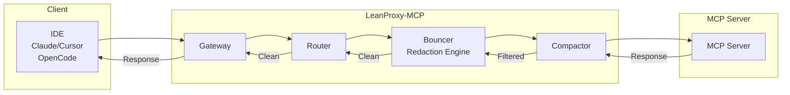
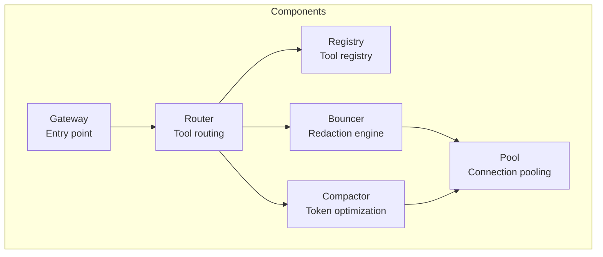
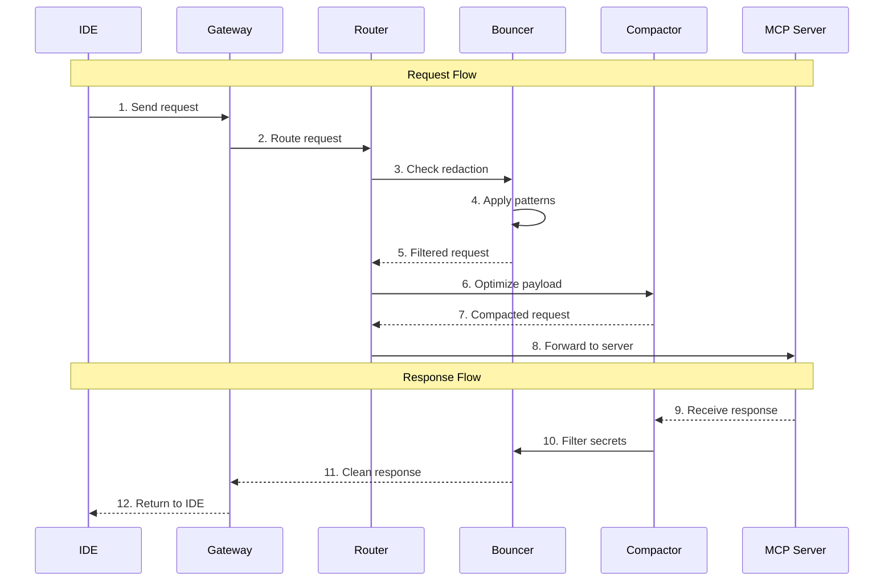
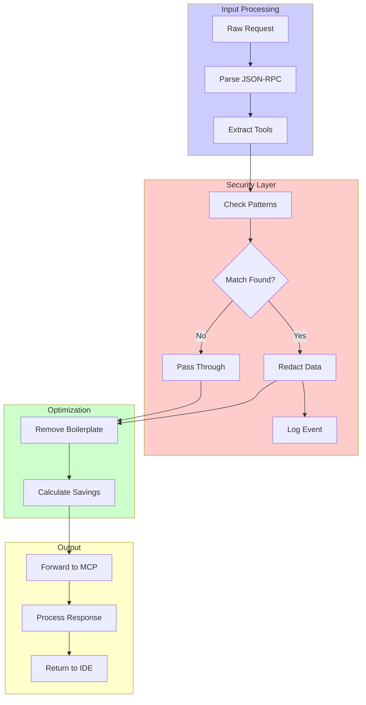
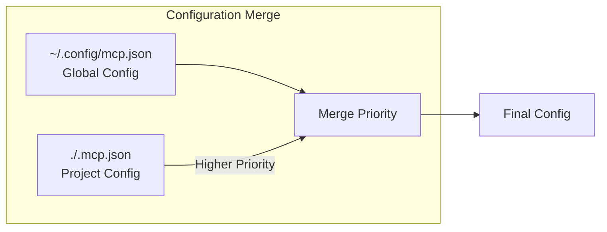
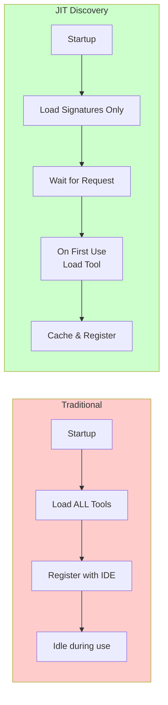
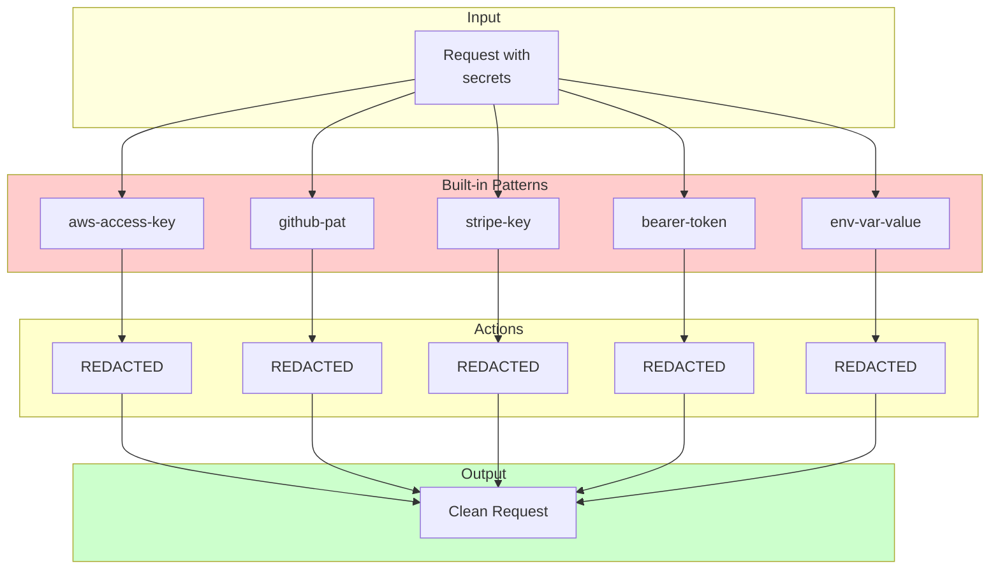

# Architecture

Understanding the LeanProxy-MCP architecture.

## Overview

LeanProxy-MCP is designed as a proxy layer between your IDE and MCP servers.



## Core Components



### 1. Gateway

The entry point that handles IDE connections and routes requests.

**Responsibilities:**
- Accept stdio and HTTP connections
- Route requests to appropriate handlers
- Manage connection lifecycle

### 2. Registry

Tool registry that maintains MCP server signatures.

**Responsibilities:**
- JIT (Just-In-Time) tool discovery
- Cache tool signatures
- Manage tool lifecycle

### 3. Router

Routes tool calls to registered MCP servers.

**Responsibilities:**
- Match tools to servers
- Load balance across servers
- Handle connection pooling

### 4. Compactor

Token optimization engine that compresses prompts.

**Responsibilities:**
- Remove boilerplate
- Compact manifests
- Estimate token savings

### 5. Redaction Engine (Bouncer)

The "Bouncer" that intercepts sensitive data.

**Responsibilities:**
- Pattern matching for secrets
- PII detection
- Configurable redaction rules

## Request/Response Flow



## Data Processing Pipeline



## Key Concepts

### Shadow Manifesting



Automatically merges:
- Global config: `~/.config/mcp.json`
- Project config: `./.mcp.json`

Project config takes precedence over global.

### JIT Discovery



Tools are registered on-demand, not at startup. This minimizes initial context overhead.

### Token Firewall

Pre-configured redaction for:
- API keys and secrets
- Environment variables
- PII (emails, phone numbers)
- AWS credentials



## Directory Structure

```mermaid
graph TD
    root["leanproxy-mcp/"] --> cmd["cmd/"]
    root --> pkg["pkg/"]
    root --> docs["docs/"]
    root --> install["install/"]

    cmd --> cmd_root["root.go"]
    cmd --> cmd_serve["serve.go"]
    cmd --> cmd_server["server.go"]
    cmd --> cmd_status["status.go"]
    cmd --> cmd_cache["cache.go"]

    pkg --> gw["gateway/"]
    pkg --> rt["router/"]
    pkg --> rg["registry/"]
    pkg --> pl["pool/"]
    pkg --> cn["concurrent/"]
    pkg --> cp["compactor/"]
    pkg --> ut["utils/"]
    pkg --> bc["bouncer/"]
    pkg --> mc["mcp/"]
    pkg --> ts["toolstore/"]
    pkg --> sf["statusfile/"]

    mc --> mc_handlers["handlers.go"]
    mc --> mc_gateway["gateway_server.go"]
    mc --> mc_types["types.go"]

    ts --> ts_filecache["filecache.go"]

    sf --> sf_file["file.go"]

    docs --> docs_index["index.md"]
    docs --> docs_install["installation.md"]
    docs --> docs_commands["commands.md"]
    docs --> docs_config["configuration.md"]

    style root fill:#ccccff
    style pkg fill:#ccffcc
    style cmd fill:#ffcc99
    style docs fill:#ffcccc
```



```
leanproxy-mcp/
├── cmd/              # CLI entry points
│   ├── root.go      # Main command
│   ├── serve.go     # serve command (HTTP proxy)
│   ├── server.go    # server command (stdio mode)
│   ├── status.go    # status command
│   └── cache.go     # cache command
├── pkg/
│   ├── gateway/    # HTTP/stdio gateway
│   ├── router/     # Tool routing
│   ├── registry/   # Tool registry
│   ├── pool/       # Connection pooling
│   ├── concurrent/ # Concurrency utilities
│   ├── compactor/  # Token optimization
│   ├── bouncer/    # Redaction engine
│   ├── mcp/        # MCP protocol implementation
│   │   ├── handlers.go    # MCP request handlers
│   │   ├── gateway_server.go  # Gateway tool implementation
│   │   └── types.go     # MCP types
│   ├── toolstore/  # Persistent tool cache
│   │   └── filecache.go  # File-based cache
│   └── statusfile/ # Shared status file
│       └── file.go   # Status file implementation
├── docs/            # Documentation
└── install/        # Installation scripts
```

## Key Packages

### MCP Package (`pkg/mcp/`)

Implements the MCP protocol handling including:
- Request routing and handling
- Tool discovery and caching
- Gateway tools (list_tools method)
- Protocol type definitions

### Tool Store (`pkg/toolstore/`)

Persistent tool cache that stores tool signatures to disk:
- `FileCache`: Persists tools to `~/.config/leanproxy/toolcache/`
- Per-server cache files (e.g., `garmin.json`, `Intervals_icu.json`)
- Avoids starting servers for tool discovery

### Status File (`pkg/statusfile/`)

Shared status file for detecting running instances:
- `FileStatusStore`: Writes status to `~/.config/leanproxy/status/current.json`
- Updated every 5 seconds by running instances
- Used by `leanproxy status --running` to show active instances

## Security

### Directory Permissions

All sensitive directories are created with `0700` permissions (owner read/write/execute only):

| Directory | Purpose |
|-----------|---------|
| `~/.leanproxy/` | Unix socket files |
| `~/.config/leanproxy/` | Config, status, and cache directories |
| `/tmp/leanproxy/` | Temporary socket files (when used) |

This ensures that:
- Socket files are protected from unauthorized access
- Config files containing tokens and patterns are not readable by other users
- Cache directories with potentially sensitive data are protected

### Socket Authentication

The socket server supports optional token-based authentication to prevent unauthorized local access. See [Configuration](./configuration.md#socket-authentication) for details.

## Logging

LeanProxy-MCP uses Go's standard `log/slog` package for structured logging. All constructors accept an optional `*slog.Logger` parameter, enabling dependency injection for testability and consistent log output control.

### Logger Injection Pattern

All package constructors accept a `*slog.Logger` parameter with a sensible default:

```go
func NewHandler(p pool.ServerSource, logger *slog.Logger) *Handler {
    if logger == nil {
        logger = slog.Default()
    }
    return &Handler{
        pool:    p,
        logger:  logger,
        // ...
    }
}
```

**Benefits:**
- **Testability**: Pass a no-op logger in tests to reduce noise
- **Consistency**: Inject the same logger across all components for unified output
- **Flexibility**: Configure log level and output destination in one place

### Constructors with Logger Support

| Package | Constructor | Default |
|---------|------------|---------|
| `pkg/mcp/` | `NewHandler(p, logger)` | `slog.Default()` |
| `pkg/pool/` | `NewStdioPool(maxPerServer, idleTimeout, logger)` | `slog.Default()` |
| `pkg/pool/` | `NewSSEPool(logger)` | `slog.Default()` |

### Structured Logging

All log calls use key-value pairs for structured output:

```go
h.logger.Info("initialized leanproxy-mcp", "client", params.ClientInfo.Name, "version", params.ClientInfo.Version)
h.logger.Debug("handling mcp request", "method", req.Method, "id", req.ID)
```

### Log Levels

| Level | Usage |
|-------|-------|
| `Debug` | Detailed diagnostic information |
| `Info` | General operational events |
| `Warn` | Unexpected but recoverable issues |
| `Error` | Errors that require attention |

### Configuration

Log level is configurable via `logging.level` in config or `LEANPROXY_LOG_LEVEL` environment variable:

```yaml
logging:
  level: "debug"  # debug, info, warn, error
  file: ""      # empty = stdout
```

## Error Handling

LeanProxy-MCP follows JSON-RPC 2.0 error handling conventions with structured logging for diagnostics.

### JSON-RPC Errors

Errors are returned using the JSON-RPC error response format:

```go
type JSONRPCError struct {
    Code    int             `json:"code"`
    Message string          `json:"message"`
    Data    json.RawMessage `json:"data,omitempty"`
}
```

**Standard Error Codes:**

| Code | Meaning |
|------|---------|
| `-32700` | Parse error - Invalid JSON received |
| `-32600` | Invalid request - Malformed JSON-RPC |
| `-32600` | Method not found - Unknown method |
| `-32500` | Internal error - Unexpected server failure |

**Custom Application Codes:**

| Code | Meaning |
|------|---------|
| `-32000` | Server error - Implementation-specific errors |

### Handler Patterns

When handling errors in MCP request handlers, return the error via JSON-RPC response:

```go
// Return error to client via JSON-RPC response
return &Response{
    Error: &JSONRPCError{
        Code:    -32000,
        Message: err.Error(),
    },
}, nil
```

**Best Practices:**
- Always return meaningful error messages to help debugging
- Use structured error data for complex failures
- Log errors at the appropriate level before returning

### Logging Levels

Use log levels to categorize error severity:

| Level | Usage |
|-------|-------|
| `Debug` | Detailed flow information, request/response content |
| `Info` | Important milestones, server startup, connections established |
| `Warn` | Recoverable issues that don't block operation |
| `Error` | Failed operations that may affect user experience |

### Error Handling Anti-Patterns

**BAD - Silent error swallowing:**

```go
// Error is logged but execution continues without handling
if err != nil {
    log.Debug("operation failed", "error", err)
    // continues without proper handling
}
```

**GOOD - Proper error propagation:**

```go
// Error is properly returned to caller
if err != nil {
    return &Response{
        Error: &JSONRPCError{
            Code:    -32000,
            Message: err.Error(),
        },
    }, err
}
```

Key principle: **Never silently ignore errors**. Either handle them properly or propagate them up the call stack.

## Next Steps

- [Commands Reference](./commands.md) - Full command documentation
- [Configuration](./configuration.md) - Customize behavior