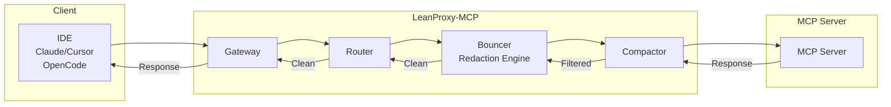
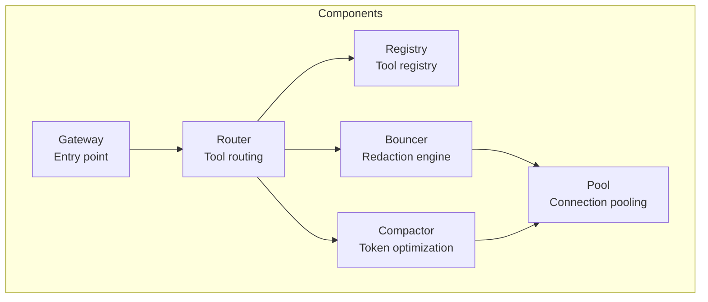
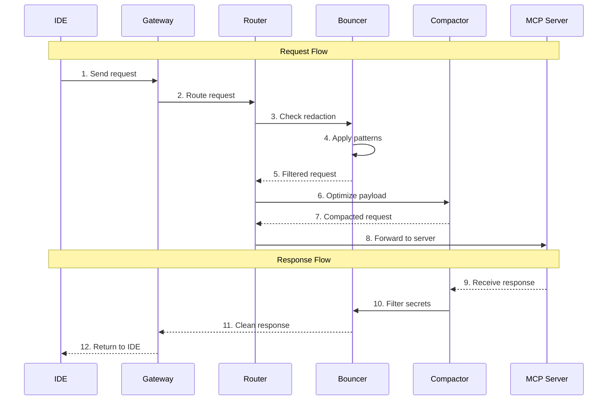
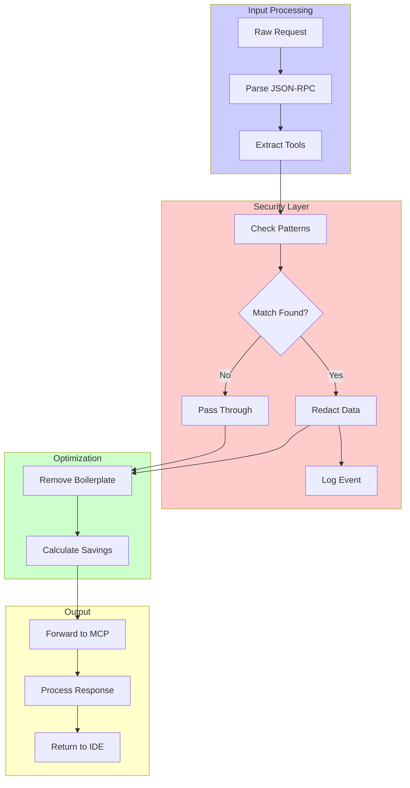
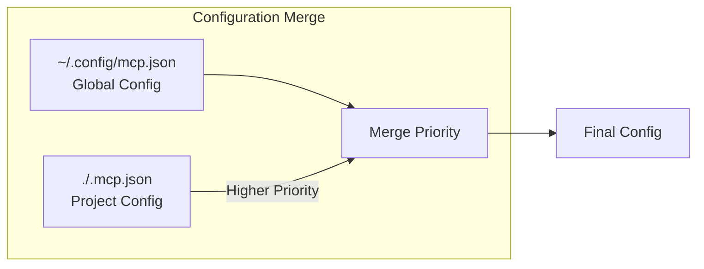
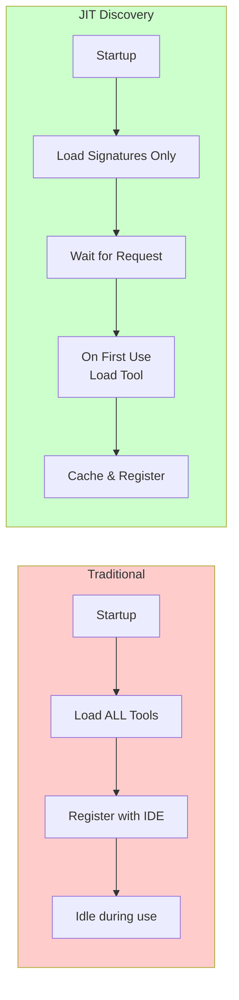
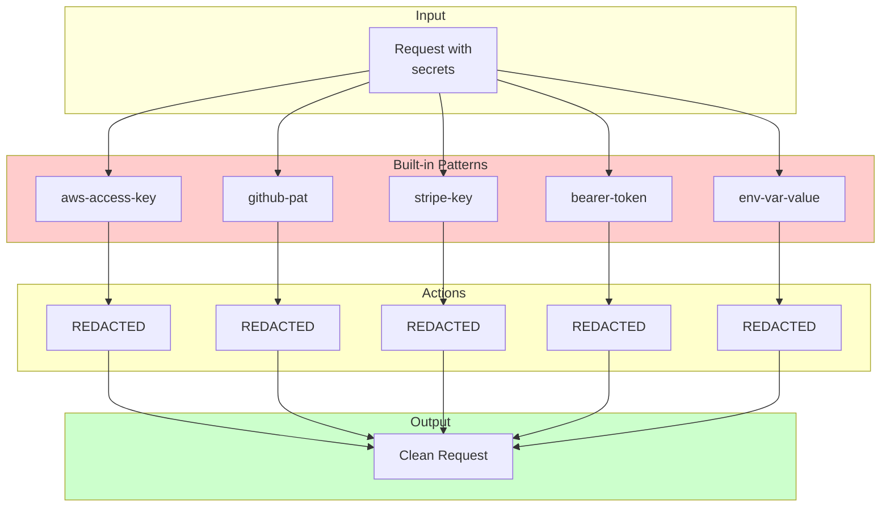

# Architecture

Understanding the LeanProxy-MCP architecture.

## Overview

LeanProxy-MCP is designed as a proxy layer between your IDE and MCP servers.



## Core Components



### 1. Gateway

The entry point that handles IDE connections and routes requests.

**Responsibilities:**
- Accept stdio and HTTP connections
- Route requests to appropriate handlers
- Manage connection lifecycle

### 2. Registry

Tool registry that maintains MCP server signatures.

**Responsibilities:**
- JIT (Just-In-Time) tool discovery
- Cache tool signatures
- Manage tool lifecycle

### 3. Router

Routes tool calls to registered MCP servers.

**Responsibilities:**
- Match tools to servers
- Load balance across servers
- Handle connection pooling

### 4. Compactor

Token optimization engine that compresses prompts.

**Responsibilities:**
- Remove boilerplate
- Compact manifests
- Estimate token savings

### 5. Redaction Engine (Bouncer)

The "Bouncer" that intercepts sensitive data.

**Responsibilities:**
- Pattern matching for secrets
- PII detection
- Configurable redaction rules

## Request/Response Flow



## Data Processing Pipeline



## Key Concepts

### Shadow Manifesting



Automatically merges:
- Global config: `~/.config/mcp.json`
- Project config: `./.mcp.json`

Project config takes precedence over global.

### JIT Discovery



Tools are registered on-demand, not at startup. This minimizes initial context overhead.

### Token Firewall

Pre-configured redaction for:
- API keys and secrets
- Environment variables
- PII (emails, phone numbers)
- AWS credentials



## Directory Structure

```mermaid
graph TD
    root["leanproxy-mcp/"] --> cmd["cmd/"]
    root --> pkg["pkg/"]
    root --> docs["docs/"]
    root --> install["install/"]

    cmd --> cmd_root["root.go"]
    cmd --> cmd_serve["serve.go"]
    cmd --> cmd_server["server.go"]
    cmd --> cmd_status["status.go"]
    cmd --> cmd_cache["cache.go"]

    pkg --> gw["gateway/"]
    pkg --> rt["router/"]
    pkg --> rg["registry/"]
    pkg --> pl["pool/"]
    pkg --> cn["concurrent/"]
    pkg --> cp["compactor/"]
    pkg --> ut["utils/"]
    pkg --> bc["bouncer/"]
    pkg --> mc["mcp/"]
    pkg --> ts["toolstore/"]
    pkg --> sf["statusfile/"]

    mc --> mc_handlers["handlers.go"]
    mc --> mc_gateway["gateway_server.go"]
    mc --> mc_types["types.go"]

    ts --> ts_filecache["filecache.go"]

    sf --> sf_file["file.go"]

    docs --> docs_index["index.md"]
    docs --> docs_install["installation.md"]
    docs --> docs_commands["commands.md"]
    docs --> docs_config["configuration.md"]

    style root fill:#ccccff
    style pkg fill:#ccffcc
    style cmd fill:#ffcc99
    style docs fill:#ffcccc
```



```
leanproxy-mcp/
├── cmd/              # CLI entry points
│   ├── root.go      # Main command
│   ├── serve.go     # serve command (HTTP proxy)
│   ├── server.go    # server command (stdio mode)
│   ├── status.go    # status command
│   └── cache.go     # cache command
├── pkg/
│   ├── gateway/    # HTTP/stdio gateway
│   ├── router/     # Tool routing
│   ├── registry/   # Tool registry
│   ├── pool/       # Connection pooling
│   ├── concurrent/ # Concurrency utilities
│   ├── compactor/  # Token optimization
│   ├── bouncer/    # Redaction engine
│   ├── mcp/        # MCP protocol implementation
│   │   ├── handlers.go    # MCP request handlers
│   │   ├── gateway_server.go  # Gateway tool implementation
│   │   └── types.go     # MCP types
│   ├── toolstore/  # Persistent tool cache
│   │   └── filecache.go  # File-based cache
│   └── statusfile/ # Shared status file
│       └── file.go   # Status file implementation
├── docs/            # Documentation
└── install/        # Installation scripts
```

## Key Packages

### MCP Package (`pkg/mcp/`)

Implements the MCP protocol handling including:
- Request routing and handling
- Tool discovery and caching
- Gateway tools (search_tools method)
- Protocol type definitions

### Tool Store (`pkg/toolstore/`)

Persistent tool cache that stores tool signatures to disk:
- `FileCache`: Persists tools to `~/.config/leanproxy/toolcache/`
- Per-server cache files (e.g., `garmin.json`, `Intervals_icu.json`)
- Avoids starting servers for tool discovery

### Status File (`pkg/statusfile/`)

Shared status file for detecting running instances:
- `FileStatusStore`: Writes status to `~/.config/leanproxy/status/current.json`
- Updated every 5 seconds by running instances
- Used by `leanproxy status --running` to show active instances

## Next Steps

- [Commands Reference](./commands.md) - Full command documentation
- [Configuration](./configuration.md) - Customize behavior