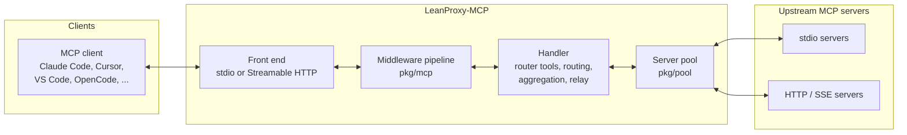
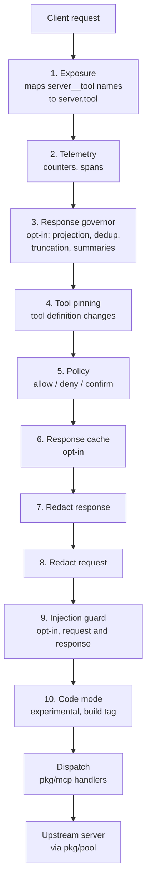
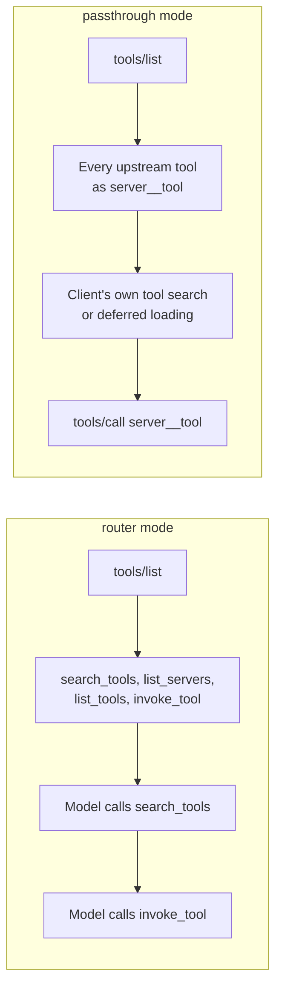

# Architecture

How LeanProxy-MCP is put together. This page describes the code as it is;
package paths are relative to the repository root.

## Overview

LeanProxy-MCP is a local MCP proxy. An MCP client (an IDE or an agent)
connects to one LeanProxy front end. LeanProxy connects to every configured
upstream MCP server, and every request and response passes through one
middleware pipeline.


```mermaid
graph LR
    subgraph Clients
        IDE[MCP client<br/>Claude Code, Cursor,<br/>VS Code, OpenCode, ...]
    end

    subgraph LeanProxy["LeanProxy-MCP"]
        FE[Front end<br/>stdio or Streamable HTTP]
        PL[Middleware pipeline<br/>pkg/mcp]
        HD[Handler<br/>router tools, routing,<br/>aggregation, relay]
        PO[Server pool<br/>pkg/pool]
    end

    subgraph Upstreams["Upstream MCP servers"]
        S1[stdio servers]
        S2[HTTP / SSE servers]
    end

    IDE <--> FE
    FE <--> PL
    PL <--> HD
    HD <--> PO
    PO <--> S1
    PO <--> S2
```

## Front ends

| Front end | Command | Code | Notes |
|-----------|---------|------|-------|
| stdio | `server run --stdio` | `cmd/stdio_frontend.go` | One client per process. Newline-delimited JSON-RPC on stdin/stdout. Requests are handled concurrently (`server.max_concurrent_requests`). |
| Streamable HTTP | `server run --http <addr>` | `pkg/streamhttp`, `cmd/http_frontend.go` | One shared local gateway at `/mcp` for many clients. Bearer token, Host/Origin checks, per-client sessions. |
| Line-TCP (deprecated) | `serve` | `cmd/serve.go`, `cmd/serve_listener.go` | Not an MCP transport; no MCP client speaks it. Scheduled for removal in v1.0. It is the only front end with the web dashboard, the `/metrics` endpoint, the semantic cache and the sidecar redactor. |

All three build the same `mcp.Handler` and the same middleware stages
(`tracedMiddlewares` in `cmd/telemetry.go`). `server run` installs them with
`Handler.Use`. `serve` wraps its own dispatch with the same list through
`mcp.Chain`. Code mode is installed only by `server run`.

## Request pipeline

Each middleware can change the request, answer it directly, or change the
response. The first stage in the list is the outermost: it sees the request
first and the response last. The order below is the one registered in
`cmd/server.go` (`tracedMiddlewares`, then `installCodeMode`):


```mermaid
flowchart TB
    C[Client request] --> E
    E[1. Exposure<br/>maps server__tool names<br/>to server.tool] --> T
    T[2. Telemetry<br/>counters, spans] --> G
    G[3. Response governor<br/>opt-in: projection, dedup,<br/>truncation, summaries] --> P
    P[4. Tool pinning<br/>tool definition changes] --> PO
    PO[5. Policy<br/>allow / deny / confirm] --> RC
    RC[6. Response cache<br/>opt-in] --> RR
    RR[7. Redact response] --> RQ
    RQ[8. Redact request] --> IJ
    IJ[9. Injection guard<br/>opt-in, request and response] --> CM
    CM[10. Code mode<br/>experimental, build tag] --> D
    D[Dispatch<br/>pkg/mcp handlers] --> U[Upstream server<br/>via pkg/pool]
```

| # | Stage | Code | Default |
|---|-------|------|---------|
| 1 | Exposure | `pkg/mcp/exposure.go`, `pkg/mcp/exposure` | On. Rewrites a passthrough name (`<server>__<tool>`) to `<server>.<tool>` so later stages see the real server and tool. |
| 2 | Telemetry | `pkg/mcp/telemetry.go` | Counters always on; OTLP export only when `telemetry.enabled`. |
| 3 | Response governor | `pkg/mcp/middleware_governor.go`, `pkg/mcp/governor` | Off (`response.enabled`). |
| 4 | Tool pinning | `pkg/mcp/toolpins.go`, `pkg/toolpin` | `warn`. |
| 5 | Policy | `pkg/mcp/middleware_policy.go`, `pkg/policy` | Allow known tools, deny unknown ones. |
| 6 | Response cache | `pkg/mcp/middleware_cache.go`, `pkg/mcp/responsecache` | Off (`response_cache.enabled`). |
| 7–8 | Redaction | `pkg/mcp/middleware_redact.go`, `pkg/bouncer` | On, 29 built-in patterns. |
| 9 | Injection guard | `pkg/mcp/middleware_injection.go`, `pkg/bouncer/injection` | Off (`injection.enabled`). |
| 10 | Code mode | `pkg/mcp/middleware_codemode.go`, `pkg/codemode` | Only in binaries built with `-tags codemode`, and only when `code_mode.enabled`. Innermost, so every tool call its program makes passes all stages above. |

On a request, redaction runs before the injection check. On a response, the
injection check runs first, then redaction, then the response cache, policy,
pinning and finally the governor. So the governor and the cache only ever see
redacted, checked results.

Traffic that upstream servers start themselves (sampling, roots, elicitation,
progress, resource updates) does not go through this chain. The relay in
`pkg/mcp/relay.go` routes it to the right client session and runs it through
the same redaction and injection checks. See
[Security](./security.md#which-modes-are-protected).

## Dispatch

After the last stage, `Handler.dispatch` (`pkg/mcp/handlers.go`) handles the
method:

- `initialize`: negotiates the protocol revision and decides the client's
  exposure mode (`pkg/mcp/protocol.go`, `pkg/mcp/exposure`).
- `tools/list`: returns the router tools, the upstream tools, or both,
  depending on the exposure mode.
- `tools/call`: a LeanProxy tool (`search_tools`, `list_servers`,
  `list_tools`, `invoke_tool`, `read_result`) is answered locally. Any other
  name is split into server and tool (`server_tool` or `server.tool`,
  longest matching server name wins, `pkg/mcp/toolname.go`) and sent to that
  server through the pool. There is exactly one server per name; there is no
  load balancing.
- `resources/*` and `prompts/*`: fanned out to the upstreams that declare the
  capability and merged (`pkg/mcp/aggregate.go`).
- `ping`, `shutdown`.

## Key concepts

### JIT Discovery

Most MCP clients load every tool definition of every server into the model's
context. With many servers this costs thousands of tokens on every turn.

In `router` mode, LeanProxy lists only four small tools instead of the full
catalogue. The model finds tools with `search_tools` (a BM25 index,
`pkg/toolsearch`), and calls them with `invoke_tool` or by their namespaced
name. Tool definitions come from the persistent tool cache
(`pkg/toolstore`), so the proxy answers immediately at start and refreshes
each server's `tools/list` in the background (`pkg/mcp/toolrefresh.go`).

Clients that already defer tool definitions themselves (Claude Code, Claude
Desktop, Cursor, VS Code) get `passthrough` mode by default instead: every
upstream tool, with its full metadata. See
[Exposure Modes](./configuration.md#exposure-modes-exposure).


```mermaid
flowchart LR
    subgraph Router["router mode"]
        A1[tools/list] --> B1[search_tools, list_servers,<br/>list_tools, invoke_tool]
        B1 --> C1[Model calls search_tools]
        C1 --> D1[Model calls invoke_tool]
    end

    subgraph Pass["passthrough mode"]
        A2[tools/list] --> B2[Every upstream tool<br/>as server__tool]
        B2 --> C2[Client's own tool search<br/>or deferred loading]
        C2 --> D2[tools/call server__tool]
    end
```

### Token Firewall

The firewall is the redaction and injection stages of the pipeline
(`pkg/mcp` `Firewall`, `Redaction`, `InjectionGuard`, with the detectors in
`pkg/bouncer`).

- Redaction is on by default. It replaces secrets that match one of the 29
  built-in patterns (cloud keys, tokens, private keys, connection strings and
  similar) or your own `bouncer.patterns` in requests and responses. An
  optional entropy detector catches unknown high-entropy strings. There is no
  detection of personal data such as email addresses or phone numbers.
- The injection guard is off by default. When on, it scores requests and
  tool results for prompt-injection patterns and blocks, quarantines, redacts
  or logs them according to `injection` policies.

Run `leanproxy-mcp bouncer list-patterns` to see the patterns. See
[Security](./security.md) and
[Configuration](./configuration.md#response-token-governor-response) for the
governor that runs outside the firewall.

### Response governor

The governor (#319–#321) is opt-in. It works on tool results that have
already passed redaction and the injection check. In order, it:

1. projects JSON results to the configured fields (`response.projections`,
   or the `fields` argument of `invoke_tool`);
2. replaces a result identical to one already returned in this session with
   a short stub (`response.dedup`);
3. shortens results over their token budget, structurally, or with a local
   LLM summary for allowlisted tools (`response.summarize`).

The full result is kept in a per-session spill store. The client can fetch it
with `read_result` or `resources/read leanproxy://results/<id>`.

## Server pool

`pkg/pool` owns the upstream connections:

- **stdio servers**: one child process per server, spawned with a
  least-privilege environment (`childenv.go`), optionally inside a Docker or
  Podman sandbox (`sandbox.go`). Requests are multiplexed over one process
  with a per-server in-flight limit (`max_in_flight`) and response-size limit
  (`max_response_bytes`). Idle processes stop after `idle_timeout`.
- **HTTP and SSE servers**: every MCP method is relayed as raw JSON over the
  mcp-go transport (`rawcall.go`), so results and upstream errors arrive
  byte for byte.
- **Handshake** (`session.go`): the pool sends `initialize` and
  `notifications/initialized` once per process generation or connection, and
  stores each server's `InitializeResult`.
- **Reliability**: health checks and automatic restart with backoff
  (`health.go`, `reconnect.go`, `reconnect:` block), and a per-server rate
  limit (`ratelimit.go`, `rate_limit:`).

## Package layout

```
leanproxy-mcp/
├── main.go
├── cmd/                 # Cobra commands: server run, serve, report, doctor, policy,
│                        # tools pins, marketplace, migrate, bouncer, status, ...
├── internal/
│   ├── logx/            # Payload logging helpers
│   └── version/         # Build version information
├── pkg/
│   ├── mcp/             # Handler, middleware pipeline, router tools, exposure,
│   │   │                # aggregation, relay, telemetry counters
│   │   ├── exposure/    # Exposure modes and client rules
│   │   ├── governor/    # Response governor internals (truncation, spill store)
│   │   └── responsecache/
│   ├── streamhttp/      # Streamable HTTP front end
│   ├── httpsec/         # Host/Origin checks, bearer tokens, security headers
│   ├── pool/            # Upstream connections: stdio, HTTP, SSE, sandbox, reconnect
│   ├── bouncer/         # Redaction patterns and engine
│   │   └── injection/   # Injection detection, judge, quarantine
│   ├── policy/          # Per-tool allow / deny / confirm rules
│   ├── toolpin/         # Tool pinning store and scanner
│   ├── toolsearch/      # BM25 / hybrid index behind search_tools
│   ├── toolstore/       # Persistent tool cache (~/.config/leanproxy/toolcache)
│   ├── codemode/        # execute_code sandbox (build tag codemode)
│   ├── telemetry/       # OpenTelemetry OTLP/HTTP exporters
│   ├── usage/           # Usage store behind `report` (~/.leanproxy/usage)
│   ├── metrics/         # JSON /metrics endpoint (serve only)
│   ├── dashboard/       # Web dashboard (serve only)
│   ├── reporter/        # Token estimator and cost tracker
│   ├── cache/           # Semantic cache, embedders, vector stores (serve only;
│   │                    # the embedders are also used by hybrid tool search)
│   ├── sidecar/         # Local LLM client (serve's sidecar redactor, governor summaries)
│   ├── gateway/         # Router tools of the serve front end
│   ├── router/          # Tool-to-server routing of the serve front end
│   ├── proxy/           # JSON-RPC types and streaming used by serve and the pools
│   ├── registry/        # Marketplace registry, sync, trust; server metadata
│   ├── migrate/         # Config types, loading and validation; import from IDE configs
│   ├── statusfile/      # Status file for `status --running`
│   ├── compactor/       # `compactor rebuild` (not used by the proxy at runtime)
│   ├── ratelimit/       # Token bucket (GitHub server)
│   ├── postgresql/      # Tools of servers/postgres
│   ├── redistools/      # Tools of servers/redis
│   ├── filesystemtools/ # Tools of servers/filesystem
│   ├── githubtools/     # Tools of servers/github
│   ├── errors/          # Shared error types
│   └── utils/           # Small helpers
├── servers/             # First-party MCP servers: postgres, redis, filesystem, github
├── extensions/          # IDE extensions: vscode, jetbrains
├── docs/                # This documentation (MkDocs)
└── install/             # Install script
```

See [First-party MCP servers](./servers.md) and
[IDE Extensions](./extensions.md).

## Files on disk

Directories LeanProxy creates are mode `0700`; files that hold tokens, pins
or usage data are `0600`.

| Path | Contents |
|------|----------|
| `~/.config/leanproxy_servers.yaml` | Configuration (default location) |
| `~/.config/leanproxy/toolcache/` | Persistent tool cache (`LEANPROXY_TOOLCACHE_DIR` overrides) |
| `~/.config/leanproxy/status/current.json` | Status of running instances |
| `~/.config/leanproxy/pins.json` | Tool pins (`LEANPROXY_PINS_FILE` overrides) |
| `~/.config/leanproxy/serve.token` | Bearer token for `server run --http` and `serve` |
| `~/.leanproxy/registry/index.json` | Marketplace registry cache |
| `~/.leanproxy/usage/` | Daily usage records for `report` |
| `~/.leanproxy/quarantine/` | Quarantined injection findings |
| `~/.leanproxy/results/` | Governor spill files, when `response.spill.disk` is on |
| `~/.leanproxy/cache/` | Semantic cache (`serve` only) |

## Logging

LeanProxy uses Go's `log/slog` with the text handler. Logs go to **stderr**
(stdout carries the MCP protocol on the stdio front end), or to the file
given with `--log-file` (created `0600`).

| Flag | Effect |
|------|--------|
| `--log-level` | `debug`, `info` (default), `warn`, `error` |
| `-v`, `--verbose` | Same as `--log-level debug` |
| `--log-file <path>` | Write logs to this file instead of stderr |

There is no `logging:` block in the configuration file, and
`LEANPROXY_LOG_LEVEL` does not set the level. (`doctor security` only reads it
to warn when it is `debug`.)

Debug logs can include fragments of request and response payloads. Do not
leave debug logging on in shared environments.

## Errors

Errors reach the client as JSON-RPC error responses:

| Code | Meaning |
|------|---------|
| `-32700` | Parse error: invalid JSON |
| `-32600` | Invalid request |
| `-32601` | Method not found |
| `-32602` | Invalid params (for example an unknown `server_tool` name) |
| `-32603` | Internal error |
| `-32000` | Server error (implementation-specific) |
| `-32001` | Request timeout (a relayed server-to-client request got no answer) |
| `-32002` | Resource not found |

An error returned by an upstream server is passed to the client unchanged.

## Next Steps

- [Commands Reference](./commands.md) - Full command documentation
- [Configuration](./configuration.md) - Customize behavior
- [Security](./security.md) - Threat model and protections
