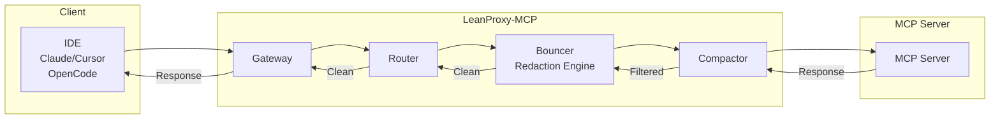
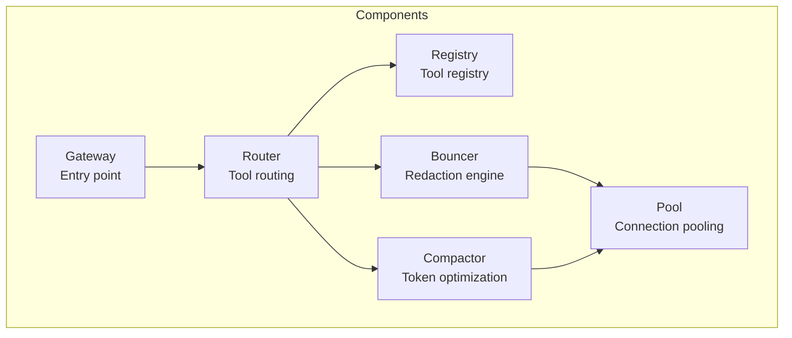
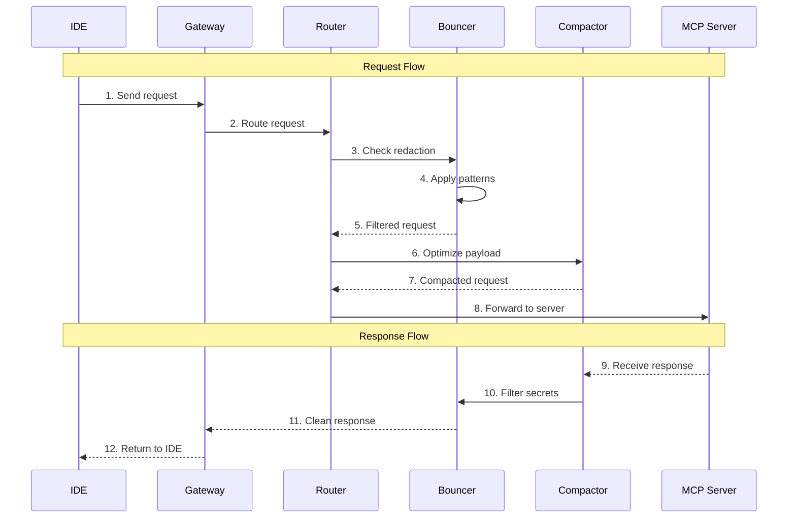
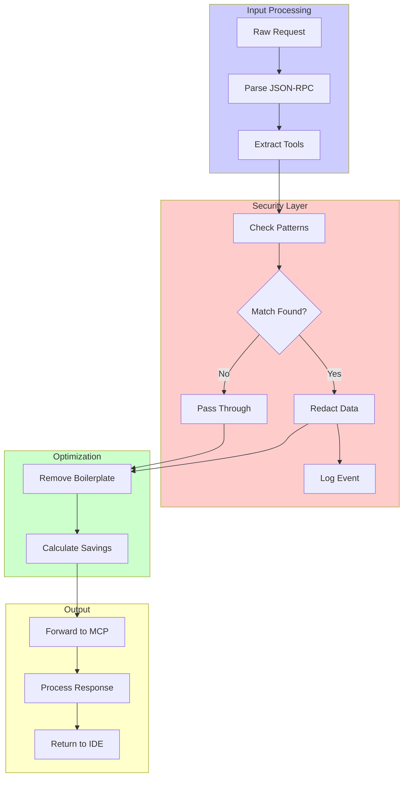
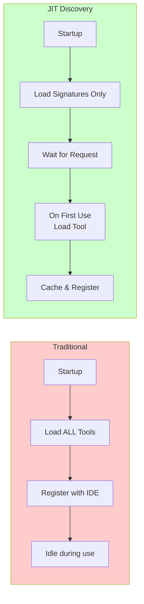
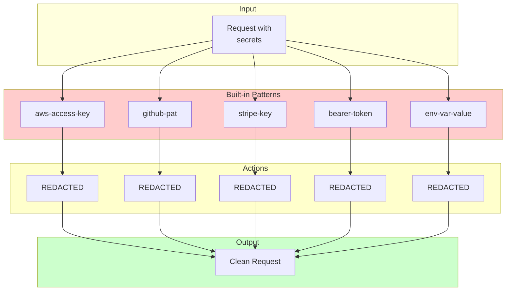
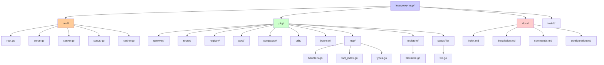

# Architecture

Understanding the LeanProxy-MCP architecture.

## Overview

LeanProxy-MCP is designed as a proxy layer between your IDE and MCP servers.


```mermaid
graph LR
    subgraph Client
        IDE[IDE<br/>Claude/Cursor<br/>OpenCode]
    end
    
    subgraph LeanProxy["LeanProxy-MCP"]
        Gateway[Gateway]
        Router[Router]
        Bouncer[Bouncer<br/>Redaction Engine]
        Compactor[Compactor]
    end
    
    subgraph Server["MCP Server"]
        MCP[MCP Server]
    end
    
    IDE --> Gateway
    Gateway --> Router
    Router --> Bouncer
    Bouncer --> Compactor
    Compactor --> MCP
    MCP -->|Response| Compactor
    Compactor -->|Filtered| Bouncer
    Bouncer -->|Clean| Router
    Router -->|Clean| Gateway
    Gateway -->|Response| IDE
```

## Core Components


```mermaid
graph TD
    subgraph Components
        GW[Gateway<br/>Entry point]
        RG[Registry<br/>Tool registry]
        RT[Router<br/>Tool routing]
        CP[Compactor<br/>Token optimization]
        BC[Bouncer<br/>Redaction engine]
        PL[Pool<br/>Connection pooling]
    end
    
    GW --> RT
    RT --> RG
    RT --> BC
    RT --> CP
    BC --> PL
    CP --> PL
```

### 1. Gateway

The entry point that handles IDE connections and routes requests.

**Responsibilities:**
- Accept stdio and HTTP connections
- Route requests to appropriate handlers
- Manage connection lifecycle

### 2. Registry

Tool registry that maintains MCP server signatures.

**Responsibilities:**
- JIT (Just-In-Time) tool discovery
- Cache tool signatures
- Manage tool lifecycle

### 3. Router

Routes tool calls to registered MCP servers.

**Responsibilities:**
- Match tools to servers
- Load balance across servers
- Handle connection pooling

### 4. Compactor

Token optimization engine that compresses prompts.

**Responsibilities:**
- Remove boilerplate
- Compact manifests
- Estimate token savings

### 5. Redaction Engine (Bouncer)

The "Bouncer" that intercepts sensitive data.

**Responsibilities:**
- Pattern matching for secrets
- PII detection
- Configurable redaction rules

## Request/Response Flow


```mermaid
sequenceDiagram
    participant IDE as IDE
    participant GW as Gateway
    participant RT as Router
    participant BC as Bouncer
    participant CP as Compactor
    participant MCP as MCP Server

    Note over IDE,MCP: Request Flow
    
    IDE->>GW: 1. Send request
    GW->>RT: 2. Route request
    RT->>BC: 3. Check redaction
    BC->>BC: 4. Apply patterns
    BC-->>RT: 5. Filtered request
    RT->>CP: 6. Optimize payload
    CP-->>RT: 7. Compacted request
    RT->>MCP: 8. Forward to server

    Note over MCP,IDE: Response Flow
    
    MCP-->>CP: 9. Receive response
    CP->>BC: 10. Filter secrets
    BC-->>GW: 11. Clean response
    GW-->>IDE: 12. Return to IDE
```

## Data Processing Pipeline


```mermaid
flowchart TB
    subgraph Input["Input Processing"]
        A[Raw Request] --> B[Parse JSON-RPC]
        B --> C[Extract Tools]
    end
    
    subgraph Security["Security Layer"]
        C --> D[Check Patterns]
        D --> E{Match Found?}
        E -->|Yes| F[Redact Data]
        E -->|No| G[Pass Through]
        F --> H[Log Event]
    end
    
    subgraph Optimization["Optimization"]
        G --> I[Remove Boilerplate]
        F --> I
        I --> J[Calculate Savings]
    end
    
    subgraph Output["Output"]
        J --> K[Forward to MCP]
        K --> L[Process Response]
        L --> M[Return to IDE]
    end
    
    style Security fill:#ffcccc
    style Optimization fill:#ccffcc
    style Input fill:#ccccff
    style Output fill:#ffffcc
```

## Key Concepts

### JIT Discovery


```mermaid
flowchart LR
    subgraph Traditional["Traditional"]
        A1[Startup] --> B1[Load ALL Tools]
        B1 --> C1[Register with IDE]
        C1 --> D1[Idle during use]
    end
    
    subgraph JIT["JIT Discovery"]
        A2[Startup] --> B2[Load Signatures Only]
        B2 --> C2[Wait for Request]
        C2 --> D2[On First Use<br/>Load Tool]
        D2 --> E2[Cache & Register]
    end
    
    style Traditional fill:#ffcccc
    style JIT fill:#ccffcc
```

Tools are registered on-demand, not at startup. This minimizes initial context overhead.

### Token Firewall

The firewall is a middleware chain in `pkg/mcp` (`Firewall`, `Redaction`,
`InjectionGuard`) shared by every front end: `server run --stdio` and
`server run --http` (the Streamable HTTP front end of `pkg/streamhttp`,
#309) install it on the MCP handler with `Handler.Use`, and `serve` wraps its
own dispatch with the same middlewares via `mcp.Chain`. Order: redact request →
injection check (request) → dispatch → injection check (response: tool
results, resources, prompts) → redact response. Later stages (caching,
metering, ...) plug into the same `Middleware` API. See
[Security](./security.md#which-modes-are-protected).

The full stage order (`cmd/telemetry.go`, `tracedMiddlewares`) is:

```
telemetry → response governor → tool pinning → policy → response cache → redact response → redact request → injection → dispatch
```

The response governor (#319, `pkg/mcp/middleware_governor.go` and
`pkg/mcp/governor`) is opt-in. After redaction and the injection check, it
projects JSON results to the configured fields (#320, `response.projections`
or `invoke_tool`'s `fields`), then, per session, replaces a result
byte-identical to one already returned this session with a short stub
(#321, `response.dedup`), then shortens those still over their token
budget — either structurally (#319) or, for an allowlisted tool over its
own threshold, with a local-LLM summary (#321, `response.summarize`,
falling back to structural truncation on any failure). It keeps the full
result in a per-session spill store and answers `read_result` and
`resources/read leanproxy://results/<id>` from it. See
[Configuration](./configuration.md#response-token-governor-response).

Pre-configured redaction for:
- API keys and secrets
- Environment variables
- PII (emails, phone numbers)
- AWS credentials


```mermaid
flowchart TB
    subgraph Input
        R[Request with<br/>secrets]
    end
    
    subgraph Patterns["Built-in Patterns"]
        P1[aws-access-key]
        P2[github-pat]
        P3[stripe-key]
        P4[bearer-token]
        P5[env-var-value]
    end
    
    subgraph Actions
        R --> P1
        R --> P2
        R --> P3
        R --> P4
        R --> P5
        P1 --> M1[REDACTED]
        P2 --> M2[REDACTED]
        P3 --> M3[REDACTED]
        P4 --> M4[REDACTED]
        P5 --> M5[REDACTED]
    end
    
    subgraph Output
        M1 & M2 & M3 & M4 & M5 --> C[Clean Request]
    end
    
    style Patterns fill:#ffcccc
    style Actions fill:#ffffcc
    style Output fill:#ccffcc
```

## Directory Structure


```mermaid
graph TD
    root["leanproxy-mcp/"] --> cmd["cmd/"]
    root --> pkg["pkg/"]
    root --> docs["docs/"]
    root --> install["install/"]

    cmd --> cmd_root["root.go"]
    cmd --> cmd_serve["serve.go"]
    cmd --> cmd_server["server.go"]
    cmd --> cmd_status["status.go"]
    cmd --> cmd_cache["cache.go"]

    pkg --> gw["gateway/"]
    pkg --> rt["router/"]
    pkg --> rg["registry/"]
    pkg --> pl["pool/"]
    pkg --> cp["compactor/"]
    pkg --> ut["utils/"]
    pkg --> bc["bouncer/"]
    pkg --> mc["mcp/"]
    pkg --> ts["toolstore/"]
    pkg --> sf["statusfile/"]

    mc --> mc_handlers["handlers.go"]
    mc --> mc_tools["tool_index.go"]
    mc --> mc_types["types.go"]

    ts --> ts_filecache["filecache.go"]

    sf --> sf_file["file.go"]

    docs --> docs_index["index.md"]
    docs --> docs_install["installation.md"]
    docs --> docs_commands["commands.md"]
    docs --> docs_config["configuration.md"]

    style root fill:#ccccff
    style pkg fill:#ccffcc
    style cmd fill:#ffcc99
    style docs fill:#ffcccc
```

```
leanproxy-mcp/
├── cmd/              # CLI entry points
│   ├── root.go      # Main command
│   ├── serve.go     # serve command (deprecated line-TCP proxy)
│   ├── server.go    # server command (server run --stdio / --http)
│   ├── http_frontend.go # server run --http wiring (auth, options, shutdown)
│   ├── status.go    # status command
│   └── cache.go     # cache command
├── pkg/
│   ├── gateway/    # HTTP/stdio gateway
│   ├── router/     # Tool routing
│   ├── registry/   # Tool registry
│   ├── pool/       # Connection pooling
│   ├── compactor/  # Token optimization
│   ├── bouncer/    # Redaction engine
│   ├── mcp/        # MCP protocol implementation
│   │   ├── handlers.go    # MCP request handlers
│   │   ├── tool_index.go  # Gateway tool definitions (search_tools, list_servers, list_tools, invoke_tool)
│   │   ├── search_tools.go # search_tools handler
│   │   ├── toolrefresh.go # Background tool cache refresh (feeds the search index)
│   │   └── types.go     # MCP types
│   ├── streamhttp/ # MCP Streamable HTTP front end (sessions, SSE streams, Host/Origin/auth checks)
│   ├── httpsec/    # Host/Origin validation and bearer-token helpers shared by the HTTP servers
│   ├── toolsearch/ # Ranked tool index behind search_tools (BM25, optional hybrid)
│   ├── toolstore/  # Persistent tool cache
│   │   └── filecache.go  # File-based cache
│   └── statusfile/ # Shared status file
│       └── file.go   # Status file implementation
├── docs/            # Documentation
└── install/        # Installation scripts
```

## Key Packages

### MCP Package (`pkg/mcp/`)

Implements the MCP protocol handling including:
- Request routing and handling
- Tool discovery and caching
- Gateway tools (search_tools, list_servers, list_tools, invoke_tool)
- Protocol type definitions (`types.go`: full MCP 2025 tool objects, raw
  content items, `CallToolResult`)
- Version negotiation and per-client sessions (`protocol.go`): the supported
  revisions are one list (`SupportedProtocolVersions`); each front end opens a
  `ClientSession` per client, carried in the request context, which records
  the negotiated revision and receives server-to-client notifications
- Resources and prompts aggregation (`aggregate.go`): fan-out of the list
  methods to the upstreams that advertise the capability (paginated, per-server
  timeouts), `leanproxy://<server>/<uri>` and `<server>.<prompt>` namespacing,
  routing of `resources/read`, `resources/subscribe` and `prompts/get`
- Relay of what the upstreams initiate (`relay.go`, `session_requests.go`;
  #308): the pool hands server-to-client requests and notifications to the
  handler (`pool.ServerMessageHandler`), which picks the client session
  (declared capability, call in flight), sends the request under a session id
  of its own (`lp-<n>`) through the front end's writer, and routes the answer
  back; progress tokens are remapped per call, resource updates go to the
  subscribed sessions, and the Token Firewall redacts (and injection-checks)
  the relayed traffic

### Tool Search (`pkg/toolsearch/`)

The ranked, cross-server index behind `search_tools`: Okapi BM25 over each
tool's server name, name (×2), description and parameters, with a small
synonym table, optionally fused with embedding similarity (Reciprocal Rank
Fusion) when `tool_search.hybrid` is enabled. The handler re-indexes a server
whenever the background refresh changes its tool list; queries read an
immutable snapshot, so they never wait for a refresh.

### Tool Store (`pkg/toolstore/`)

Persistent tool cache that stores tool signatures to disk:
- `FileCache`: Persists tools to `~/.config/leanproxy/toolcache/` (override with `LEANPROXY_TOOLCACHE_DIR`)
- Per-server cache files (e.g., `garmin.json`, `Intervals_icu.json`)
- Loaded at startup so both front ends serve immediately; the handler then refreshes each server's
  `tools/list` in the background (`pkg/mcp/toolrefresh.go`)

### Server sessions (`pkg/pool/session.go`)

The pool owns the MCP handshake. For stdio servers every process generation (a counter bumped on each
spawn or respawn) sends `initialize` and `notifications/initialized` exactly once, before any other request
of that generation; concurrent first callers share it. HTTP/SSE servers use the mcp-go client's own
`Initialize` on each connection. Every handshake asks for the latest MCP revision
(`RequestedProtocolVersion`) and accepts the server's answer. The `InitializeResult` (negotiated revision,
capabilities, `serverInfo`, `instructions`) is stored per server (`ServerInitializeResult`), and the pools
report lifecycle events (`EventSessionStarted`, `EventToolsListChanged`, `EventResourcesListChanged`,
`EventPromptsListChanged`, surfaced from the stdout reader and the mcp-go notification handler): tool
events trigger a background refresh of that server's tools, resource/prompt events a `list_changed`
notification to the clients.

For HTTP/SSE servers, every MCP method (`tools/list`, `tools/call`, `resources/*`, `prompts/*`, ...) is
relayed as raw JSON on the mcp-go transport (`pkg/pool/rawcall.go`), so results, arguments and upstream
JSON-RPC errors travel byte for byte instead of through mcp-go's typed results.

### Status File (`pkg/statusfile/`)

Shared status file for detecting running instances:
- `FileStatusStore`: Writes status to `~/.config/leanproxy/status/current.json`
- Updated every 5 seconds by running instances
- Used by `leanproxy status --running` to show active instances

## Security

### Directory Permissions

All sensitive directories are created with `0700` permissions (owner read/write/execute only):

| Directory | Purpose |
|-----------|---------|
| `~/.leanproxy/` | Unix socket files |
| `~/.config/leanproxy/` | Config, status, and cache directories |
| `/tmp/leanproxy/` | Temporary socket files (when used) |

This ensures that:
- Socket files are protected from unauthorized access
- Config files containing tokens and patterns are not readable by other users
- Cache directories with potentially sensitive data are protected

### Socket Authentication

The socket server supports optional token-based authentication to prevent unauthorized local access. See [Configuration](./configuration.md#socket-authentication) for details.

## Logging

LeanProxy-MCP uses Go's standard `log/slog` package for structured logging. All constructors accept an optional `*slog.Logger` parameter, enabling dependency injection for testability and consistent log output control.

### Logger Injection Pattern

All package constructors accept a `*slog.Logger` parameter with a sensible default:

```go
func NewHandler(p pool.ServerSource, logger *slog.Logger) *Handler {
    if logger == nil {
        logger = slog.Default()
    }
    return &Handler{
        pool:    p,
        logger:  logger,
        // ...
    }
}
```

**Benefits:**
- **Testability**: Pass a no-op logger in tests to reduce noise
- **Consistency**: Inject the same logger across all components for unified output
- **Flexibility**: Configure log level and output destination in one place

### Constructors with Logger Support

| Package | Constructor | Default |
|---------|------------|---------|
| `pkg/mcp/` | `NewHandler(p, logger)` | `slog.Default()` |
| `pkg/pool/` | `NewStdioPool(maxPerServer, idleTimeout, logger)` | `slog.Default()` |
| `pkg/pool/` | `NewSSEPool(logger)` | `slog.Default()` |

### Structured Logging

All log calls use key-value pairs for structured output:

```go
h.logger.Info("initialized leanproxy-mcp", "client", params.ClientInfo.Name, "version", params.ClientInfo.Version)
h.logger.Debug("handling mcp request", "method", req.Method, "id", req.ID)
```

### Log Levels

| Level | Usage |
|-------|-------|
| `Debug` | Detailed diagnostic information |
| `Info` | General operational events |
| `Warn` | Unexpected but recoverable issues |
| `Error` | Errors that require attention |

### Configuration

Log level is configurable via `logging.level` in config or `LEANPROXY_LOG_LEVEL` environment variable:

```yaml
logging:
  level: "debug"  # debug, info, warn, error
  file: ""      # empty = stdout
```

## Error Handling

LeanProxy-MCP follows JSON-RPC 2.0 error handling conventions with structured logging for diagnostics.

### JSON-RPC Errors

Errors are returned using the JSON-RPC error response format:

```go
type JSONRPCError struct {
    Code    int             `json:"code"`
    Message string          `json:"message"`
    Data    json.RawMessage `json:"data,omitempty"`
}
```

**Standard Error Codes:**

| Code | Meaning |
|------|---------|
| `-32700` | Parse error - Invalid JSON received |
| `-32600` | Invalid request - Malformed JSON-RPC |
| `-32600` | Method not found - Unknown method |
| `-32500` | Internal error - Unexpected server failure |

**Custom Application Codes:**

| Code | Meaning |
|------|---------|
| `-32000` | Server error - Implementation-specific errors |

### Handler Patterns

When handling errors in MCP request handlers, return the error via JSON-RPC response:

```go
// Return error to client via JSON-RPC response
return &Response{
    Error: &JSONRPCError{
        Code:    -32000,
        Message: err.Error(),
    },
}, nil
```

**Best Practices:**
- Always return meaningful error messages to help debugging
- Use structured error data for complex failures
- Log errors at the appropriate level before returning

### Logging Levels

Use log levels to categorize error severity:

| Level | Usage |
|-------|-------|
| `Debug` | Detailed flow information, request/response content |
| `Info` | Important milestones, server startup, connections established |
| `Warn` | Recoverable issues that don't block operation |
| `Error` | Failed operations that may affect user experience |

### Error Handling Anti-Patterns

**BAD - Silent error swallowing:**

```go
// Error is logged but execution continues without handling
if err != nil {
    log.Debug("operation failed", "error", err)
    // continues without proper handling
}
```

**GOOD - Proper error propagation:**

```go
// Error is properly returned to caller
if err != nil {
    return &Response{
        Error: &JSONRPCError{
            Code:    -32000,
            Message: err.Error(),
        },
    }, err
}
```

Key principle: **Never silently ignore errors**. Either handle them properly or propagate them up the call stack.

## Next Steps

- [Commands Reference](./commands.md) - Full command documentation
- [Configuration](./configuration.md) - Customize behavior