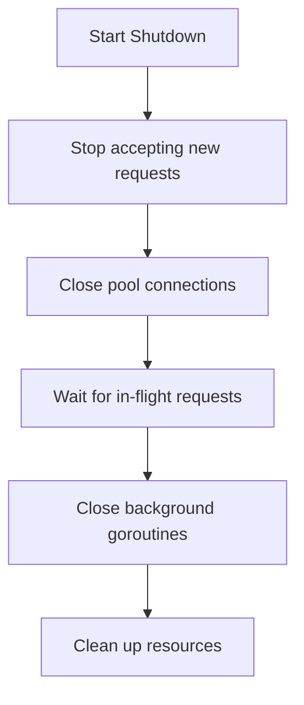

# Graceful Shutdown

Proper shutdown of LeanProxy-MCP ensures all in-flight requests complete and resources are cleaned up correctly.

## Overview

LeanProxy-MCP components that require graceful shutdown:

| Component | Package | Shutdown Method |
|-----------|---------|-----------------|
| StdioPool | `pkg/pool` | `Close()` |
| SSEPool | `pkg/pool` | `Close()` |
| HTTPClientPool | `pkg/pool` | `Close()` |
| UnifiedPool | `pkg/pool` | `Close()` |
| RateLimiter | `pkg/concurrent` | `Close()` |
| MultiServerRateLimiter | `pkg/concurrent` | `Close()` |
| LifecycleManager | `pkg/registry` | `Close()` |

## Shutdown Sequence

Follow this order for proper shutdown:



### Code Example

```go
type Application struct {
    pool             *pool.StdioPool
    rateLimiter      *concurrent.MultiServerRateLimiter
    lifecycleManager registry.LifecycleManager
}

func (a *Application) Shutdown(ctx context.Context) error {
    var errs []error

    // 1. Stop accepting new requests and close pool
    if a.pool != nil {
        if err := a.pool.Close(); err != nil {
            errs = append(errs, fmt.Errorf("pool close: %w", err))
        }
    }

    // 2. Close rate limiter (stops background cleanup goroutines)
    if a.rateLimiter != nil {
        a.rateLimiter.Close()
    }

    // 3. Close lifecycle manager (stops process reaper goroutine)
    if a.lifecycleManager != nil {
        a.lifecycleManager.Close()
    }

    // Check for errors
    if len(errs) > 0 {
        return errors.Join(errs...)
    }
    return nil
}
```

## Component Details

### Pool (`pkg/pool`)

The pool manages MCP server connections and requires proper closure:

```go
// StdioPool, SSEPool, HTTPClientPool, UnifiedPool all have Close()
if err := pool.Close(); err != nil {
    logger.Error("failed to close pool", "error", err)
    // Log but continue cleanup
}
```

The pool's `Close()` method:
- Stops accepting new requests
- Signals all server processes to stop (SIGTERM)
- Waits for all goroutines to complete
- Closes all connections

### RateLimiter (`pkg/concurrent`)

```go
// Single server rate limiter
rl := concurrent.NewRateLimiter(10, time.Second)
defer rl.Close()

// Multi-server rate limiter
msrl := concurrent.NewMultiServerRateLimiter(config)
defer msrl.Close()
```

The `Close()` method:
- Closes the stop channel
- Waits for the cleanup goroutine to finish using WaitGroup

### LifecycleManager (`pkg/registry`)

```go
lm := registry.NewLifecycleManager(logger)
defer lm.Close()
```

The `Close()` method:
- Closes the stop channel
- Waits for the process reaper goroutine to finish

### FileCache (`pkg/toolstore`)

FileCache does not require explicit closing as it has no background goroutines:

```go
fc, err := toolstore.NewFileCache(logger)
// No Close() needed - resources are released when garbage collected
```

## Error Handling During Shutdown

Best practices for handling errors during shutdown:

```go
func (a *Application) Shutdown(ctx context.Context) error {
    var shutdownErrors []error

    // Always attempt cleanup, even if previous steps failed
    if err := a.cleanupPool(); err != nil {
        shutdownErrors = append(shutdownErrors, fmt.Errorf("pool: %w", err))
    }

    if err := a.cleanupRateLimiter(); err != nil {
        shutdownErrors = append(shutdownErrors, fmt.Errorf("ratelimiter: %w", err))
    }

    if err := a.cleanupLifecycleManager(); err != nil {
        shutdownErrors = append(shutdownErrors, fmt.Errorf("lifecycle: %w", err))
    }

    // Return best-effort results - don't fail on non-critical errors
    if len(shutdownErrors) > 0 {
        // Log all errors
        for _, err := range shutdownErrors {
            logger.Error("shutdown error", "error", err)
        }
        // Return combined error but don't block
        return fmt.Errorf("shutdown completed with errors: %v", shutdownErrors)
    }

    logger.Info("shutdown complete")
    return nil
}
```

**Key principles:**
- Log all errors but continue cleanup
- Use `errors.Join()` to combine multiple errors
- Return best-effort results rather than failing completely

## Timeout for Shutdown

Implement a timeout to prevent indefinite blocking:

```go
func (a *Application) ShutdownWithTimeout(timeout time.Duration) error {
    ctx, cancel := context.WithTimeout(context.Background(), timeout)
    defer cancel()

    done := make(chan error, 1)

    go func() {
        done <- a.Shutdown(ctx)
    }()

    select {
    case err := <-done:
        return err
    case <-ctx.Done():
        logger.Warn("shutdown timed out, forcing exit")
        return ctx.Err()
    }
}
```

## Signal Handling (CLI Applications)

For CLI applications, handle OS signals to initiate graceful shutdown:

```go
func main() {
    ctx, cancel := context.WithCancel(context.Background())
    defer cancel()

    sigChan := make(chan os.Signal, 1)
    signal.Notify(sigChan, syscall.SIGINT, syscall.SIGTERM)

    app := NewApplication()

    go func() {
        sig := <-sigChan
        fmt.Printf("Received signal %v, initiating graceful shutdown...\n", sig)
        cancel()
    }()

    if err := app.Run(ctx); err != nil {
        fmt.Fprintf(os.Stderr, "Error: %v\n", err)
        os.Exit(1)
    }

    // Wait for shutdown to complete
    if err := app.Shutdown(context.Background()); err != nil {
        fmt.Fprintf(os.Stderr, "Shutdown error: %v\n", err)
    }
}
```

## Complete Example

```go
package main

import (
    "context"
    "log/slog"
    "os"
    "os/signal"
    "syscall"
    "time"

    "github.com/mmornati/leanproxy-mcp/pkg/concurrent"
    "github.com/mmornati/leanproxy-mcp/pkg/pool"
)

type Application struct {
    logger  *slog.Logger
    pool    *pool.StdioPool
    limiter *concurrent.MultiServerRateLimiter
    wg      sync.WaitGroup
    ctx     context.Context
    cancel  context.CancelFunc
}

func NewApplication() *Application {
    ctx, cancel := context.WithCancel(context.Background())
    logger := slog.Default()

    limiter := concurrent.NewMultiServerRateLimiter(concurrent.RateLimiterConfig{
        MaxRequests: 10,
        Window:      time.Second,
    })

    p, err := pool.NewStdioPool(5, 5*time.Minute, logger)
    if err != nil {
        logger.Error("failed to create pool", "error", err)
        os.Exit(1)
    }

    return &Application{
        logger:  logger,
        pool:    p,
        limiter: limiter,
        ctx:     ctx,
        cancel:  cancel,
    }
}

func (a *Application) Run() error {
    a.logger.Info("application started")
    <-a.ctx.Done()
    return nil
}

func (a *Application) Shutdown() error {
    a.logger.Info("starting shutdown")

    // Cancel context to stop accepting new work
    a.cancel()

    var errs []error

    // Close pool (stops servers, waits for goroutines)
    if err := a.pool.Close(); err != nil {
        errs = append(errs, fmt.Errorf("pool: %w", err))
    }

    // Close rate limiter (stops cleanup goroutine)
    a.limiter.Close()

    a.logger.Info("shutdown complete")
    return errors.Join(errs...)
}

func main() {
    app := NewApplication()

    sigChan := make(chan os.Signal, 1)
    signal.Notify(sigChan, syscall.SIGINT, syscall.SIGTERM)

    go func() {
        <-sigChan
        app.cancel()
    }()

    if err := app.Run(); err != nil {
        app.logger.Error("run error", "error", err)
    }

    if err := app.Shutdown(); err != nil {
        app.logger.Error("shutdown error", "error", err)
    }
}
```

## Integration with MCP Servers

When embedding LeanProxy-MCP in another application:

```go
func main() {
    // Create components
    logger := slog.Default()
    cache, _ := toolstore.NewFileCache(logger)
    limiter := concurrent.NewMultiServerRateLimiter(config)
    p, _ := pool.NewStdioPool(maxConn, timeout, logger)

    // Create handler
    handler := mcp.NewHandler(p, cache, logger)

    // Use handler...

    // On shutdown:
    handler.Close()           // Stop accepting requests
    p.Close()                 // Close pool
    limiter.Close()           // Close rate limiter
    cache = nil              // Let GC handle it
}
```

## Next Steps

- [Architecture](./architecture.md) - System architecture
- [Configuration](./configuration.md) - Configuration options
- [Commands](./commands.md) - CLI commands